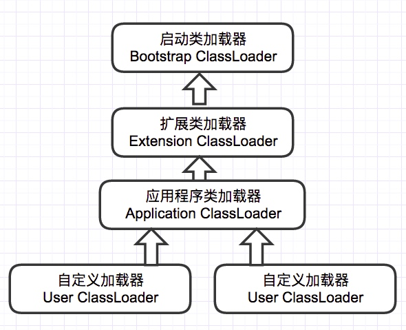

# JVM

## JVM内存模型

### 程序计数器（Program Counter Register）
* 是一块线程私有的较小的内存空间，可以看作是当前线程所执行的字节码的行号指示器，字节码解释器工作时就是通过改变这个计数器的值来选取下一条需要执行的字节码指令。
* 程序计数器是唯一一个在JVM中没有规定任何OutOfMemoryError情况的区域。

### 线程栈（Java Virtual Machine Stack，JVM栈）
* 每个线程都有一个线程私有的栈，它的生命周期与线程相同。
* 线程中每个方法执行时会压入一个栈帧（Stack Frame），栈帧用于存储局部变量表、操作数栈、动态链接、方法出口等信息。
* 局部变量表中存放的数据是基本数据类型、对象引用和返回地址（指向一条字节码指令的地址）。基本数据类型中，64位长度的long和double会占用2个Slot，其余数据类型只占用1个Slot。局部变量表所需的内存空间在编译期间完成分配。
* 如果线程请求的栈深度大于JVM允许的深度，将抛出StackOverFlowError异常；如果线程栈可以动态扩展，但扩展时无法申请到足够的内存，将抛出OutOfMemoryError异常。

### 本地方法栈（Native Method Stack）
* 与线程栈作用相似，区别在于线程栈为Java方法（字节码）服务，而本地方法栈则为Native方法服务。
* 没有强制规定具体实现，可以把线程栈和本地方法栈合二为一。
* 与线程栈一样，本地方法栈也会抛出StackOverFlowError异常和OutOfMemoryError异常。

### Java堆（Java Heap）
* JVM所管理的内存中最大的一块，被所有线程共享的内存区域，在虚拟机启动时创建。
* Java堆用来存放对象示例，几乎所有的对象示例和数组都在这里分配内存。
* 不是所有的对象都在堆里分配内存，是因为逃逸分析、栈上分配、标量替换等技术发展之后，有些对象可以放在栈中。
* Java堆是GC管理的主要区域，所以Java堆也被称为GC堆。
* Java堆可以处于物理不连续的内存空间中，只要逻辑上连续即可。
* 如果在堆中没有内存完成实例分配，并且堆也无法再扩展时，将会抛出OutOfMemoryError异常。

### 方法区（Method Area）
* 又称为永久代（Perm Generation），是所有线程共享的内存区域，用于存储已被虚拟机加载的类信息、常量、静态变量、即时编译器编译后的代码等数据。
* 方法区除了和Java堆一样不需要连续的物理内存和可以选择固定大小或可扩展外，还可以选择不实现垃圾收集。
* 当方法区无法满足内存分配需求时，将抛出OutOfMemoryError异常。

### 运行时常量池（Runtime Constant Pool）
* 是方法区的一部分，用于存放编译期生成的各种字面量、符号引用和翻译出来的直接引用，这部分内容将在类加载后存放于运行时常量池。
* 运行时常量池相对于Class文件常量池的另外一个重要特征是动态性，即常量不一定只有编译器产生，运行时也可以把新的常量放入池中，比如String.intern()方法。
* 当常量池无法再申请到内存时会抛出OutOfMemoryError异常。

### 直接内存（Direct Memory）
* 并不是虚拟机运行时数据区的一部分，也叫堆外内存。
* 配置虚拟机内存大小的参数（-Xmx）时不能忽略，因为当各个内存区域总和大于物理内存的限制时，会抛出OutOfMemoryError。

## String.intern()方法详解
* new String()是在堆上创建字符串对象，当调用intern()方法时，编译器会将字符串添加到常量池中，并返回指向该常量的引用。
* 通过字面量赋值创建字符串时，如String str=”twm”，会先在常量池中查找是否存在相同的字符串，若存在，则将栈中的引用直接指向该字符串；若不存在，则在常量池中生成一个字符串，再将栈中的引用指向该字符串。
* 常量字符串的“+”操作，编译阶段直接会合成为一个字符串。如string str=”JA”+”VA”，在编译阶段会直接合并成语句String str=”JAVA”。
* 对于final字段，编译期直接进行了常量替换，而对于非final字段则是在运行期进行赋值处理的。如：final String str1=”JA”; final String str2=”VA”; String str3=str1+str2; 这段代码在编译时，直接替换成了String str3=”JA”+”VA”; 然后根据上一条规则，再次替换成String str3=”JAVA”。
* 常量字符串和变量拼接时，如String str3=baseStr+“01”; 会调用StringBuilder.append()在堆上创建新的对象。
* JDK1.7后，intern方法还是会先去查询常量池中是否有已经存在，如果存在，则返回常量池中的引用，这一点与之前没有区别，区别在于，如果在常量池找不到对应的字符串，则不会再将字符串拷贝到常量池，而只是在常量池中生成一个对原字符串的引用。简单的说，就是往常量池放的东西变了：原来在常量池中找不到时，复制一个副本放到常量池，1.7后则是将在堆上的地址引用复制到常量池。

## 创建对象

### 对象的创建过程
1. 检查常量池中是否有即将要创建的这个对象所属的类的符号引用，如果没有则说明这个类还没有被定义，抛出ClassNotFoundException。
2. 检查这个符号引用所代表的类是否已经被JVM加载，如果该类没有被加载就找该类的class文件，并加载该类进方法区。
3. 根据方法区中该类的信息确定该类所需的内存大小，然后从堆中划分一块对应大小的内存空间给新的对象。分配堆中内存有两种方式：
    * 指针碰撞：如果堆中空闲内存是完整的区域，并且空闲内存和已使用内存之间由一个指针标记。那么当为一个对象分配内存时，只需移动指针即可。因此，这种在完整空闲区域上通过移动指针来分配内存的方式就叫做“指针碰撞”。
    * 空闲列表：如果堆中空闲区域和已使用区域交错，因此需要用一张“空闲列表”来记录堆中哪些区域是空闲区域，从而在创建对象的时候根据这张“空闲列表”找到空闲区域，并分配内存。
4. 为对象中的成员变量赋上初始值，即默认初始化。
5. 设置对象头中的信息，创建对象完成。

### 对象的内存模型
对象在内存中分为三个部分：对象头、实例数据、对齐补充。

#### 对象头
对象头中记录了对象在运行过程中所需要使用的一些数据：哈希码、GC分代年龄、锁状态标志、线程持有的锁、偏向线程ID、偏向时间戳等。此外对象头中可能还包含类型指针，通过该指针能确定这个对象所属哪个类。如果对象是一个数组，那么对象头中还要包含数组长度。

#### 实例数据
实例数据部分就是成员变量的值，其中包含父类的成员变量和本类的成员变量。

#### 对齐补充
用于确保对象的总长度为8字节的整数倍。HotSpot要求对象的总长度必须是8字节的整数倍。由于对象头一定是8字节的整数倍，但实例数据部分的长度是任意的，因此需要对齐补充字段确保整个对象的总长度为8的整数倍。

### 访问对象的方法
引用类型的变量中存放的是一个地址，那么根据地址类型的不同，对象有不同的访问方式。

#### 句柄访问方式 
* 堆中需要有一块叫做“句柄池”的内存空间，用于存放所有对象的地址和所有对象所属类的类信息。
* 引用类型的变量存放的是该对象在句柄池中的地址。访问对象时，首先需要通过引用类型的变量找到该对象的句柄，然后根据句柄中对象的地址再访问对象。

#### 直接指针访问方式 
* 引用类型的变量直接存放对象的地址，从而不需要句柄池，通过引用能够直接访问对象。 
* 但对象所在的内存空间中需要额外的策略存储对象所属的类信息的地址。

## 垃圾收集器（Garbage Collector，GC）
System.gc()和Runtime.gc()用来提示JVM要进行垃圾回收。但是，立即开始还是延迟进行垃圾回收是取决于JVM的。

### Java堆内存

#### 新生代（Young Generation）
* 新生代由一个Eden与两个Survivor Space（From和To）构成，大小通过-Xmn参数指定，Eden与Survivor Space的内存大小比例默认为8:1:1，可以通过-XX:SurvivorRatio参数指定。
* Eden：大多数情况下，新对象都在Eden中分配，当Eden没有足够空间时，会触发一次Minor GC。
* Survivor：当新生代发生GC（Minor GC）时，会将Eden和From中存活的对象移动到To，并清空Eden区域，然后From和To交换角色，再次发生Minor GC时重复该过程。因此存活对象会反复在两个Survivor Space之间移动，移动时对象的GC年龄自动累加，当GC年龄超过默认阈值15时，会将该对象移动到老年代，可以通过参数-XX:MaxTenuringThreshold对GC年龄的阈值进行设置。
* 动态对象年龄判定：如果在Suvivor空间中相同年龄所有对象大小的总和大于Survivor空间的一半，年龄大于或等于该年龄的对象就可以直接进入老年代。
* 空间分配担保
    * 在发生Minor GC时，虚拟机会检查老年代连续的空闲区域是否大于新生代所有对象的总和，若成立，则说明Minor GC是安全的，否则，虚拟机需要查看HandlePromotionFailure的值，看是否允许担保失败，若允许，则虚拟机继续检查老年代最大可用的连续空间是否大于历次晋升到老年代对象的平均大小，若大于，将尝试进行一次Minor GC；若小于或者HandlePromotionFailure设置不运行冒险，那么此时将改成一次Full GC。
    * 其中冒险是指经过一次Minor GC后有大量对象存活，而新生代的Survivor区放不下这些存活的对象，所以需要老年代进行分配担保，把Survivor区无法容纳的对象直接进入老年代。
    * 以上是JDK Update 24之前的策略，之后的策略改变了，只要老年代的连续空间大于新生代对象总大小或者历次晋升的平均大小就会进行Minor GC，否则将进行Full GC。

#### 老年代（Old Generation）
* 老年代用来存放大对象（需要很大连续空间的对象，如很长的字符串和数组）和经过几次Minor GC之后依旧存活的对象，空间大小就是-Xmx与-Xmn两个参数之差。
* 当老年代的空间不足时，会触发Major GC／Full GC，速度一般比Minor GC慢10倍以上。

#### 永久代（Permanent Generation）
* JDK8以前，类的元数据如方法数据、方法信息（字节码，栈和变量大小）、运行时常量池、已确定的符号引用和虚方法表等被保存在永久代中，32位默认永久代的大小为64M，64位默认为85M，可以通过参数-XX:MaxPermSize进行设置，一旦类的元数据超过了永久代大小，就会抛出OOM异常。
* 在JDK8的HotSpot中，把永久代从Java堆中移除了，并把类的元数据直接保存在本地内存区域（堆外内存），称之为元空间。这样做的好处：对永久代的调优过程非常困难，永久代的大小很难确定，其中涉及到太多因素，如类的总数、常量池大小和方法数量等，而且永久代的数据可能会随着每一次Full GC而发生移动。而在JDK8中，类的元数据保存在本地内存中，元空间的最大可分配空间就是系统可用内存空间，可以避免永久代的内存溢出问题，不过需要监控内存的消耗情况，一旦发生内存泄漏，会占用大量的本地内存。
* 注意：JDK7之前的HotSpot，字符串常量池的字符串被存储在永久代中，因此可能导致一系列的性能问题和内存溢出错误。在JDK8中，字符串常量池中只保存字符串的引用。

### 判断对象存活的方法
GC动作发生之前，需要确定堆内存中哪些对象是存活的，一般有两种方法：引用计数法和可达性分析法。Java主要用的是可达性分析法。

#### 引用计数法
* 在对象里添加一个引用计数器，每当有一个地方引用该对象时，计数器值就加1；当该引用失效时，计数器值就减1。任何时刻计数器值为0的对象表示不可能再被使用。
* 引用计数法实现简单，判定高效，但不能解决对象之间相互引用的问题。

#### 可达性分析法
* 通过一系列称为GC Roots的对象作为起点，从这些节点开始向下搜索，搜索路径称为引用链，当一个对象到GC Roots没有任何引用链相连时（图论中称为不可达），意味着该对象可以被回收。
* 以下对象可作为GC Roots：
    * 本地变量表中引用的对象
    * 方法区中静态变量引用的对象
    * 方法区中常量引用的对象
    * Native方法引用的对象
* 在可达性分析法中，判定一个对象是否可回收，至少要经历两次标记过程：
    1. 如果该对象到GC Roots没有引用链，则进行第一次标记。
    2. 如果该对象重写了finalize()方法，且还未执行过，那么它会被插入到F-Queue队列中，然后由一个虚拟机自动创建的、低优先级的Finalizer线程触发其finalize()方法。finalize()方法是对象逃脱死亡的最后机会，GC会对队列中的对象进行第二次标记，如果该对象在finalize()方法中与引用链上的任何一个对象建立联系，那么它就会被移出“即将回收”的集合。

> 当然了，在实际项目中应该尽量避免使用finalize方法。

### Java的四种引用
* 强引用：new出的对象之类的引用，只要强引用还在，宁愿抛OOM异常也不会回收。
* 软引用（SoftReference）：内存溢出异常之前回收，多用于缓存场景。
* 弱引用（WeakReference）：GC发现了就回收，常用于HashMap或HashSet中key为对象时，应该使用WeakHashMap和WeakHashSet。
* 虚引用（PhantomReference）：也是GC发现了就回收，但在回收前会放入ReferenceQueue，而其他引用都是回收后才放入的，虚引用常用于引用销毁前的处理工作，一般很少用到。

### 回收方法区（永久代）
* 方法区的垃圾收集主要包括两部分内容：废弃常量和无用的类。
* 废弃常量：回收废弃常量与回收Java堆中的对象非常相似。以常量池中字面量的回收为例，若字符串“abc”已经进入常量池中，但当前系统没有任何String对象引用常量池中的“abc”常量，也没有其他地方引用该字面量，若发生内存回收，且必要的话，该“abc”就会被系统清理出常量池。常量池中其他的类（接口）、方法、字段的符号引用与此类似。
* 无用的类：满足以下3个条件就会被回收：
    * 该类所有的实例都已经被回收，即Java堆中不存在该类的任何实例；
    * 加载该类的ClassLoader已经被回收；
    * 该类对应的java.lang.Class对象没有在任何地方被引用，无法在任何地方通过反射访问该类的方法。

### 垃圾收集算法

#### 标记-清除算法（Mark-Sweep）
* 分为“标记”和“清除”两个阶段：首先标记出所有需要回收的对象，在标记完成后统一回收掉所有被标记的对象。
* 是最基础的收集算法，因为后续的收集算法都是基于这种思路并对其缺点进行改进而得到的。
* 缺点有两个：一个是效率问题，标记和清除过程的效率都不高；另外一个是空间问题，标记清除之后会产生大量不连续的内存碎片，空间碎片太多可能会导致，当程序在以后的运行过程中需要分配较大对象时无法找到足够的连续内存而不得不提前触发另一次垃圾收集动作。

#### 复制算法（Copying）
* 将可用内存按容量划分为大小相等的两块，每次只使用其中的一块。当这一块的内存用完了，就将还存活着的对象复制到另外一块上面，然后再把已使用过的内存空间一次清理掉。
* 这样使得每次都是对其中的一块进行内存回收，内存分配时也就不用考虑内存碎片等复杂情况，只要移动堆顶指针，按顺序分配内存即可，实现简单，运行高效。
* 这种算法的代价是将内存缩小为原来的一半，持续复制长生存期的对象则导致效率降低。

#### 标记-整理算法（Mark-Compact）
* 复制收集算法在对象存活率较高时就要执行较多的复制操作，效率将会变低。更关键的是，如果不想浪费50%的空间，就需要有额外的空间进行分配担保，以应对被使用的内存中所有对象都100%存活的极端情况，所以在老年代一般不能直接选用这种算法。
* 根据老年代的特点，有人提出了“标记-整理“算法，标记过程仍然与“标记-清除“算法一样，但后续步骤不是直接对可回收对象进行清理，而是让所有存活的对象都向一端移动，然后直接清理掉端边界以外的内存。

#### 分代收集算法
* 把Java堆分为新生代和老年代，这样就可以根据各个年代的特点采用最适当的收集算法。
* 在新生代中，每次垃圾收集时都发现有大批对象死去，只有少量存活，那就选用复制算法，只需要付出少量存活对象的复制成本就可以完成收集。
* 而老年代中因为对象存活率高、没有额外空间对它进行分配担保，就必须使用“标记-清理”或“标记-整理”算法来进行回收。

### 对象标记过程
在可达性分析过程中，为了准确找出与GC Roots相关联的对象，必须要求整个执行引擎看起来像是被冻结在某个时间点上，即暂停所有运行中的线程，不可以出现对象的引用关系还在不断变化的情况。

#### 如何快速枚举GC Roots？
* GC Roots主要在全局性的引用（常量或类静态属性）与执行上下文（本地变量表中的引用）中，很多应用仅仅方法区就上百兆，如果进行遍历查找，效率会非常低下。
* 在HotSpot中，使用一组称为OopMap的数据结构进行实现。类加载完成时，HotSpot把对象内什么偏移量上是什么类型的数据计算出来存储到OopMap中，通过JIT编译出来的本地代码，也会记录下栈和寄存器中哪些位置是引用。GC发生时，通过扫描OopMap的数据就可以快速标识出存活的对象。

#### 如何进行安全的GC？
* 线程运行时，只有在到达安全点（Safe Point）才能停顿下来进行GC。
* 基于OopMap数据结构，HotSpot可以快速完成GC Roots的遍历，不过HotSpot并不会为每条指令都生成对应的OopMap，只会在Safe Point处记录这些信息。
* 所以Safe Point的选择很重要，如果太少可能导致GC等待的时间太长，如果太频繁可能导致运行时的性能问题。大部分指令的执行时间都非常短暂，通常会选择一些执行时间较长的指令作为Safe Point，如方法调用、循环跳转和异常跳转等。

#### 发生GC时，如何让所有线程跑到最近的Safe Point再暂停？
* 当发生GC时，不直接对线程进行中断操作，而是简单的设置一个中断标志，每个线程运行到Safe Point的时候，主动去轮询这个中断标志，如果中断标志为真，则将自己进行中断挂起。
* 这里忽略了一个问题，当发生GC时，运行中的线程可以跑到Safe Point后进行挂起，而那些处于Sleep或Blocked状态的线程在此时无法响应JVM的中断请求，无法到Safe Point处进行挂起，针对这种情况，可以使用安全区域（Safe Region）进行解决。
* Safe Region是指在一段代码片段中，对象的引用关系不会发生变化，在这个区域中的任何位置开始GC都是安全的。
    * 当线程运行到Safe Region的代码时，首先标识已经进入了Safe Region，如果这段时间内发生GC，JVM会忽略标识为Safe Region状态的线程；
    * 当线程即将离开Safe Region时，会检查JVM是否已经完成GC，如果完成了，则继续运行，否则线程必须等待直到收到可以安全离开Safe Region的信号为止。

### 垃圾收集器
如果说收集算法是内存回收的方法论，垃圾收集器就是内存回收的具体实现。

#### Serial收集器 & Serial Old收集器
* 采用单个线程的收集器，进行垃圾收集时，必须暂停其他所有的工作线程（Stop The World）。
* 在新生代采用复制算法（Serial收集器），在老年代采用标记-整理算法（Serial Old收集器）。
* 对于单CPU环境来说，Serial由于没有线程交互的开销，可以简单而高效的进行垃圾收集动作，是Client模式下新生代默认的收集器。

#### ParNew 收集器
* 其实就是Serial收集器的多线程版本，除此之外和Serial一样。
* 在新生代采用复制算法，在老年代采用标记-整理算法。
* 是许多Server模式下的首选的新生代收集器，因为除了Serial收集器外，只有它能和CMS收集器配合工作。

#### Parallel Scavenge收集器 & Parallel Old收集器
* 类似ParNew收集器，但更关注吞吐量，称为“吞吐量优先”的收集器。
* 吞吐量 = 用户代码运行时间 /（用户代码运行时间 + 垃圾收集时间）
* 可以通过参数来打开自适应调节策略，虚拟机会根据当前系统的运行情况收集性能监控信息，动态调整这些参数以提供最合适的停顿时间或最大的吞吐量；也可以通过参数控制GC的时间不大于多少毫秒或者比例。
* 在新生代采用复制算法（Parallel Scavenge收集器），在老年代采用标记-整理算法（Parallel Old收集器）。

#### CMS 收集器（Concurrent Mark Sweep）
* 以获取最短回收停顿时间为目标，是一个使用“标记-清除”算法实现的老年代收集器。
* CMS的回收过程分为4步：
    1. 初始标记（initial mark）：需要Stop The World，仅仅标记GC Roots能够直接关联到的对象，速度很快；
    2. 并发标记（concurrent mark）：进行GC Roots Tracing的过程，就是从GC Roots开始往下追溯，和用户线程并发执行；
    3. 重新标记（remark）：用于修正并发标记期间由于用户程序继续运行而导致标记产生变动的那部分记录，需要Stop The World，但停顿时间远比并发标记的时间短；
    4. 并发清理（concurrent sweep）：可以和用户线程一起工作。
* CMS收集器的缺点：
    * 基于标记-清除算法实现的，意味着收集结束后会造成大量的内存碎片，可能导致出现老年代剩余空间很大，却无法找到足够大的连续空间分配当前对象，不得不提前触发一次Full GC。
    * 对CPU资源比较敏感，在并发阶段，虽然不会导致用户线程停顿，但是会占用一部分线程资源，降低系统的总吞吐量。
    * 无法处理浮动垃圾，即并发清理阶段其他用户线程运行时出现的垃圾，只能下一次GC再清理。
    * 如果CMS运行期间预留的内存无法满足用户线程需要，会出现一次”Concurrent Mode Failure”失败，这时虚拟机会启动Serial Old收集器对老年代进行垃圾收集，这样停顿时间会很长。

#### G1 收集器（Garbage-First）
* 与CMS收集器相比，G1收集器有以下优点：
    * 并行与并发：G1能充分利用多个CPU来缩短Stop The World的停顿时间。
    * 分代收集：不需要其他收集配合就可以管理整个Java堆，采用不同的方式处理新建的对象、已经存活一段时间和经历过多次GC的对象获取更好的收集效果。
    * 空间整合：G1收集器采用标记-整理算法，不会产生内存空间碎片。分配大对象时不会因为无法找到连续空间而提前触发下一次GC。
    * 预测停顿：这是G1的另一大优势，可以建立可预测的停顿时间模型，能让使用者明确指定在一个长度为N毫秒的时间片段内，消耗在垃圾收集上的时间不得超过N毫秒。
* 内存分区（Region）思路：
    * G1收集器将整个Java堆划分为多个大小相等的Region，虽然还保留有新生代和老年代的概念，但新生代和老年代不再是物理隔阂了，它们都是一部分（可以不连续）Region的集合。
    * G1会跟踪各个Region的垃圾收集情况（回收空间大小和回收消耗的时间），维护一个优先列表，根据允许的收集时间，优先回收价值最大的Region，避免在整个Java堆上进行全区域的垃圾回收，确保了G1收集器可以在有限的时间内尽可能收集更多的垃圾。
    * 回收时以Region为单位进行回收，存活的对象复制到另一个空闲Region中。
* 不过问题来了：使用G1收集器，一个对象分配在某个Region中，可以和Java堆上任意的对象有引用关系，那么如何判定一个对象是否存活，是否需要扫描整个Java堆？针对这种情况，虚拟机提供了一个解决方案：G1收集器中Region之间的对象引用关系和其他收集器中新生代与老年代之间的对象引用关系被保存在Remenbered Set数据结构中，用来避免全堆扫描。G1中每个Region都有一个对应的Remenbered Set，当虚拟机发现程序对Reference类型的数据进行写操作时，会产生一个Write Barrier暂时中断写操作，检查Reference引用的对象是否处于相同的Region中，如果不是，则通过CardTable把相关引用信息记录到被引用对象所属Region的Remenbered Set中。

## Class类文件的结构

### 类文件简介
* 每一个类文件都对应着一个类或接口的定义信息，但是类或接口并不一定都得定义在文件里，譬如类或接口也可以通过类加载器直接生成。
* 每个类文件都是由以8字节为单位的字节流组成，所有的16位、32位和64位长度的数据将被构造成2个、4个和8个8字节单位来表示。多字节数据项总是按照大端存储的顺序进行存储。**注：大端存储顺序是指按高位字节在地址最低位，最低字节在地址最高位来存储数据。**
* 在类文件中，各部分按照严格顺序连续存放，它们之间没有任何填充或对齐作为各项间的分隔符号。
* 定义了一组私有数据类型来表示类文件的内容，它们包括u1、u2和u4，分别代表了1、2和4个字节的无符号数。

### 类文件内容
| 类型 | 名称 | 数量 | 含义 |
| --- | --- | --- | --- |
| u4 | magic | 1 | 魔数 |
| u2 | minor_version | 1 | 副版本号 |
| u2 | major_version | 1 | 主版本号 |
| u2 | constant_pool_count | 1 | 常量池计数器 |
| cp_info | constant_pool | constant_pool_count-1 | 常量池 |
| u2 | access_flags | 1 | 访问标志 |
| u2 | this_class | 1 | 类索引 |
| u2 | super_class | 1 | 父类索引 |
| u2 | interfaces_count | 1 | 接口计数器 |
| u2 | interfaces | interfaces_count | 接口表 |
| u2 | fields_count | 1 | 字段计数器 |
| field_info | fields | fields_count | 字段表 |
| u2 | methods_count | 1 | 方法计数器 |
| method_info | methods | methods_count | 方法表 |
| u2 | attributes_count | 1 | 属性计数器 |
| attribute_info | attributes | attributes_count | 属性表 |

> 其中以"_info"结尾的类型是指：由多个无符号数或者其它表作为数据项构成的复合数据类型。

* 魔数：固定为0xCAFEBABE不变，作用是确定该class文件是否为一个能被虚拟机所接受的类文件。
* 副版本号和主版本号：共同构成了class文件的格式版本号。
* 常量池计数器：等于常量池中常量的数量+1，常量池的索引范围是0<index<constant_pool_count。
* 常量池：主要存储两类常量——字面量和符号引用。字面量包括文本字符串、声明为final的常量值等；而符号引用包括类和接口的全局限定名、字段的名称和描述符、方法的名称和描述符等。
* 访问标志：包括该class文件是类还是接口，是否被定义成public，是否是abstract，如果是类，是否被声明成final等信息。
* 类索引：用于确定类的全限定名的常量池索引，可以从常量池中查找。
* 父类索引：用于确定父类的全限定名的常量池索引，可以从常量池中查找。
* 接口计数器：表示当前类或接口的直接父接口数量。
* 接口表：其中每个项的值是一个常量池索引。
* 字段计数器：表示当前类或接口的字段数量。
* 字段表：描述该class文件中声明的变量，包含类级别变量以及实例变量，但是不包括方法内部声明的局部变量。每一项包含一个字段的所有信息。
* 方法计数器：表示当前类或接口的方法数量。
* 方法表：描述该class文件中的方法。每一项包含一个方法的所有信息。
* 属性计数器：表示当前类或接口的属性数量。
* 属性表：描述该class文件中的属性。每一项包含一个属性的所有信息。

## JVM的类加载机制

### 简介

#### 类加载是什么
* 首先，代码编译后会生成JVM能够识别的字节码文件（*.class）。
* 而JVM把Class文件中的类描述数据从文件加载到内存，并对数据进行校验、转换解析、初始化，使这些数据最终成为可以被JVM直接使用的Java类型。
* 这个过程叫做JVM的类加载机制。

#### 类的生命周期
* 类从加载到JVM内存中，到卸载出内存过程有七个生命周期阶段，类加载机制包括了前五个阶段。
    1. 加载（Loading）
    2. 验证（Verification）
    3. 准备（Preparation）
    4. 解析（Resolution）
    5. 初始化（Initialization）
    6. 使用（Using）
    7. 卸载（Unloading）
* 其中，加载、验证、准备、初始化、卸载的开始顺序是确定的。**注意，只是按顺序开始，进行与结束的顺序并不一定。**

#### 类加载和初始化的时机：主动引用和被动引用
* 主动引用（会发生类的初始化）：
    * new一个对象。
    * 调用类的静态成员（除了final常量）和静态方法。
    * 通过反射对类进行调用，并且类没有初始化时。
    * 虚拟机启动，main方法所在类被提前初始化。
    * 初始化一个类，如果其父类没有初始化，则先初始化父类。
* 被动引用（不发生类的初始化）：
    * 当访问一个静态变量时，只有真正声明这个变量的类才会初始化。即子类调用父类的静态变量，只有父类初始化，子类不初始化。
    * 通过数组定义类引用，不会触发此类的初始化。
    * 调用final变量不会触发此类的初始化，因为在编译阶段就存储在常量池中。

### JVM类加载流程

#### 1. 加载（Loading）
将class文件／jar包／war包／JSP文件转换成的对应class类文件加载在内存中，然后在堆中生成一个代表这个类的java.lang.Class对象，作为数据访问的入口。

#### 2. 验证（Verification）
确保Class文件的字节流中包含的信息符合当前虚拟机的要求，并且不会危害虚拟机自身的安全。

#### 3. 准备（Preparation）
正式为类变量分配内存并设置类变量的初始值阶段，即在方法区中分配这些变量所使用的内存空间。

#### 4. 解析（Resolution）
指虚拟机将class文件中常量池中的符号引用替换为直接引用的过程。

#### 5. 初始化（Initialization）
* 是类加载最后一个阶段，前面的类加载阶段之后，除了在加载阶段可以自定义类加载器以外，其它操作都由JVM主导。到了初始阶段，才开始真正执行类中定义的Java程序代码。
* 初始化阶段是执行类初始化方法<client>的过程，虚拟机保证<client>方法执行之前先执行父类的<client>方法。这里的<client>方法是由编译器自动收集类中的类变量的赋值操作和静态语句块中的语句合并而成的。**注：如果一个类中没有对静态变量赋值也没有静态语句块，那么编译器可以不为这个类生成<client>()方法。**

### 类加载器和双亲委派模型

#### 类加载器简介
* 虚拟机设计团队把加载动作放到JVM外部实现，以便让应用程序决定如何获取所需的类。
* 类加载器用在加载阶段（Loading）。

#### JVM的三种类加载器
* 启动类加载器（Bootstrap ClassLoader）：负责加载JAVA_HOME\lib目录中的，或通过-Xbootclasspath参数指定路径中的，且被虚拟机认可（按文件名识别，如rt.jar）的类。
* 扩展类加载器（Extension ClassLoader）：负责加载 JAVA_HOME\lib\ext目录中的，或通过java.ext.dirs系统变量指定路径中的类。
* 应用程序类加载器（Application ClassLoader）：负责加载用户路径（CLASSPATH）上的类。

> JVM通过双亲委派模型进行类的加载，当然我们也可以通过继承java.lang.ClassLoader实现自定义的类加载器。

#### 双亲委派模型

* 当一个类加载器收到类加载任务，会先交给其父类加载器去完成，因此最终加载任务都会传递到顶层的启动类加载器，只有当父类加载器无法完成加载任务时，才会尝试自己执行加载任务。
* 采用双亲委派的一个好处是比如加载位于rt.jar包中的类java.lang.Object，不管是哪个加载器加载这个类，最终都是委托给顶层的启动类加载器进行加载，这样就保证了使用不同的类加载器最终得到的都是同样一个Object对象。

## JIT（Just In Time）编译器

### 概述
* 在主流商用JVM（HotSpot、J9）中，Java程序一开始是通过解释器（Interpreter）进行解释执行的。当JVM发现某个方法或代码块运行特别频繁时，就会把这些代码认定为热点代码（Hot Spot Code），然后JVM会把这些代码编译成与本地平台相关的机器码，并进行各种层次的优化，完成这个任务的编译器称为：即时编译器（Just In Time Compiler，JIT）。
* JIT编译器是“动态编译器”的一种，相对的“静态编译器”则是指的比如：C/C++的编译器。
* JIT并不是JVM的必须部分，JVM规范并没有规定JIT必须存在，更没有限定和指导JIT。但是，JIT性能的好坏、代码优化程度的高低却是衡量一款JVM是否优秀的最关键指标之一，也是虚拟机中最核心且最能体现虚拟机技术水平的部分。

### 编译对象
* 编译对象就是之前说的“热点代码”，它有两类：
    * 被多次调用的方法：一个方法被多次调用，理应称为热点代码，这种编译也是虚拟机中标准的JIT编译方式。
    * 被多次执行的循环体：编译动作由循环体出发，但编译对象依然会以整个方法为对象；这种编译方式由于编译发生在方法执行过程中，因此形象的称为：栈上替换（On Stack Replacement，OSR）编译，即方法栈帧还在栈上，方法就被替换了。

### 触发条件
判断一段代码是不是热点代码，是不是需要触发JIT编译，这样的行为称为：热点探测（Hot Spot Detection）。

#### 主流的热点探测方式
* 基于计数器的热点探测（Counter Based Hot Spot Detection）：虚拟机会为每个方法（或每个代码块）建立计数器，统计执行次数，如果超过阀值那么就是热点代码。缺点是维护计数器开销。
* 基于采样的热点探测（Sample Based Hot Spot Detection）：虚拟机会周期性检查各个线程的栈顶，如果某个方法经常出现在栈顶，那么就是热点代码。缺点是不精确。
* 基于踪迹的热点探测（Trace Based Hot Spot Detection）：Dalvik中的JIT编译器使用这种方式。

#### HotSpot使用的热点探测方式
HotSpot使用的是第一种，基于计数器的热点探测，因此它为每个方法准备了两类计数器：方法调用计数器（Invocation Counter）和回边计数器（Back Edge Counter）：

##### 方法计数器
* 默认阀值，在Client模式下是1500次，Server是10000次，可以通过参数“-XX:CompileThreshold”来设定。
* 当一个方法被调用时会首先检查是否存在被JIT编译过的版本，如果存在则使用此本地代码来执行；如果不存在，则将方法计数器+1，然后判断“方法计数器和回边计数器之和”是否超过阀值，如果是则会向编译器提交一个方法编译请求。
* 默认情况下，执行引擎并不会同步等待上面的编译完成，而是会继续解释执行。当编译完成后，此方法的调用入口地址会被系统自动改写为新的本地代码地址。
* 还有一点，热度是会衰减的，也就是说不是仅仅+，也会-，热度衰减动作是在虚拟机的GC执行时顺便进行的。

##### 回边计数器
* 回边，顾名思义，只有执行到大括号”}”时才算+1。
* 默认阀值，Client下13995，Server下10700。
* 它的调用逻辑和方法计数器差不多，只不过遇到回边指令时+1、超过阀值时会提交栈上替换OSR编译请求以及这里没有热度衰减。

### 优化技术

#### 逃逸分析（Escape Analysis）
* 逃逸分析不是具体的优化手段，而是作为类似标量替换等技术的前置分析技术。
* 如果能证明别的线程或方法无法通过任何途径访问到一个对象，那么就说对象没有逃逸，可以进行标量替换。

#### 标量替换（Scalar Replacement） 
* 不能分解的数据类型称为标量，就是Java中原始数据类型（包括引用），反之是聚合量（Java对象）。
* 把一个对象拆散，将其成员变量恢复为原始数据类型来访问，就叫做标量替换。
* 如果逃逸分析证明一个对象没有逃逸，且对象可以被拆散的话，那么程序执行时可能不在堆中创建这个对象，而直接改为在栈空间中创建成员变量让对象所在的方法来访问。

