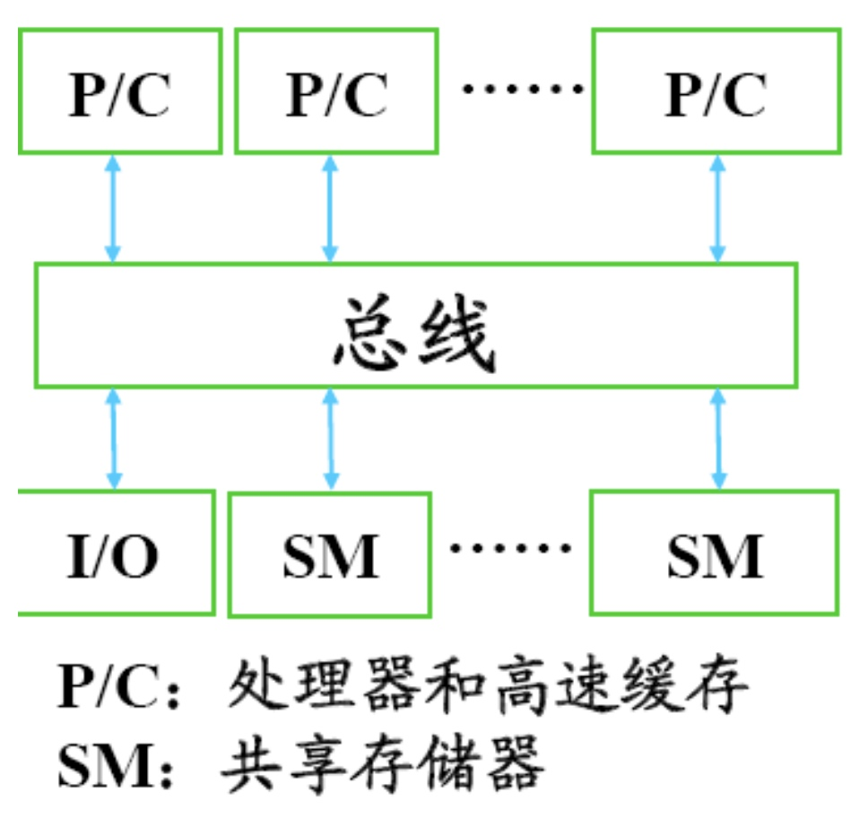

# Ch1-1 并行计算模型与系统

## Flynn分类法

### SISD（Single Instruction，Single Data stream）

* 所有指令串行执行，且在某个时钟周期内CPU只能处理一个数据流，处理速度由处理器决定。
* 应用：单处理器的计算机、冯诺依曼结构。

### SIMD（Single Instruction，Multiple Data Streams）

* 同一时刻，各个处理器做的指令完全一致，但接受的数据不同。
* 应用：CRAY向量机、Intel MMX多媒体支持／流媒体加速。

### MISD（Multiple Instructions，Single Data Stream）
* 对同一数据采用不同指令来处理。
* 仅为理论模型，实际一般不采用。

### MIMD（Multiple Instructions，Multiple Data Streams）

* 不同处理器接受不同的数据集，对其采用不同的指令处理，是应用最广泛的模型。
* 应用：Intel和AMD的双核处理器等。
* 按照不同的指标，还可以继续划分。

## MIMD的子分类

### 共享内存（Shared Memory）
* 特点：所有处理器共享一块内存区域。
* 优点：比分布式存储简单，CPU之间不需要直接通信。
* 缺点：有局限性，一个处理器会影响整个系统；可靠性和可扩展性差，处理器增加会导致内存争存，内存带宽是最大问题。

### 分布式存储（Distributed Memory）
* 特点：每个处理器有自己私有的内存空间，通过互联网络（IPC channel）通信。
* 优点：可扩展性强。
* 缺点：比共享存储复杂，实现难度更大。

## MIMD的另一种分类
* SPMD（Single Program，Multiple Data）：不同处理器只能执行同一个程序。
* MPMD（Multiple Program Multiple Data）：不同处理器可以执行多个不同的程序。

## 多节点系统架构

> 注：实际的机器一定不会将缓存和寄存器共享，因为缓存都是针对特定处理器的。

## 并行计算机模型

### 特点
* 主要是理论模型，用于设计并行算法。
* 来自程序员视角的抽象并行机，不同于冯诺依曼架构中的顺序执行。

### 定义：语义属性和性能属性

#### 语义属性
* 同构性：执行并行程序时，并行计算机中处理器的行为相似到何种程度以及该模型如何分类到Flynn标准中。
* 同步性：处理器执行指令的同步有多严格。
* 交互机制：处理器的执行线索（并行进程或线程）之间如何相互影响，如何获知对方的数据。
* 地址空间：进程或线程可访问的地址空间。
    * 单地址空间和多地址空间：多地址空间时，两个CPU的内存空间并不完全重合，同一地址可能对应不同的物理单元。
    * 均匀存储器访问（UMA，Uniform Memory Access）和非均匀存储器访问（NUMA，Non-Uniform Memory Access）：访问一段存储器内容不同单元的速度相同或不同，虚存、远程存储等因素都可能造成此现象。
* 存储器模型：如何处理共享存储器的访问冲突。

#### 性能属性

|  名称 | 说明 | 符号 | 单位 |
| --- | --- | --- | --- |
| 机器规模 | 可以并行执行的计算单元数量 | n | 无量纲 |
| 时钟速率 | CPU的主频 | f | MHz |
| 工作负载 | 程序运行完成需要的指令数量，不同的指令类型执行时间不同，这里统一以浮点指令为衡量标准 | W | Mflop |
| 顺序执行时间 | 串行程序运行时间 | T1 | s |
| 并行执行时间 | 并行程序运行时间 | Tn | s |
| 速度 | 单位时间执行的工作量，Pn=W/Tn | Pn | Mflop/s |
| 加速比 | Sn=T1/Tn | Sn | 无量纲 |
| 效率 | 单位核心上的加速比，En=Sn/n | En | 无量纲 |
| 利用率 | 并行计算的速度与多台机器并行计算的速度和的比值，Un=Pn/(n*Ppeak) | Un | 无量纲 |
| 启动时间 |  | t | us |
| 渐进带宽 | 描述网络在长期传输时能达到的稳定速率 | r | MB/s |

## 并行系统中的操作和开销

### 并行系统中的操作类型
* 计算操作：原有串行计算机中的所有操作类型，包括传统的序列编程里有的算数逻辑、数据转换、控制流等操作。
* 并行操作：管理进程／线程的操作，包括创建／终止、分组和上下文切换。
* 交互操作：进程／线程的通信、同步操作。

### 并行系统的开销（overhead）
* 并行开销：由进程／线程管理而产生的开销。
* 通信开销：由进程／线程间交换信息而产生的开销。
* 同步开销：由进程／线程的同步操作而产生的开销。
* 负载不平衡开销：因各个计算单元的负载分配不平衡而产生的开销。如果负载的平均的，各计算单元都能满负荷运行，任务量大小的分别造成了执行时间的加长。

### 不可并行的例子
* Ackerman函数：一般递归问题，必须要求将返回值表之前的返回值全部计算出来。
* 加密算法：设计者特意如此，一旦加密算法可并行，密码的破解会相当容易。
* 无理数逼近：通过迭代法进行，没有之前的结果不可进行后一次迭代。
* 工作流、控制流。

## 并行计算模型

### PRAM模型（Parallel Random Access Model）

#### 特点
* 规模为n的PRAM：n个处理器，一个共享空间，一个公共时钟。
* 机器规模n可以为任意大，基本时间步称为周期，在一个周期内每个CPU只能执行一条指令，这条指令有可能是空指令（不做任何操作），如果是空指令则称处理器在该周期闲置。
* 一个周期中可以用一条指令完成读存储器、算术操作、写存储器三个操作。
* 所有处理器共享一个公共时钟（隐式同步），所以不需要同步开销；CPU之间通过读、写共享变量进行通信，所以也不需要通信开销；PRAM中没有启动和关闭进程／线程的问题，所以也没有并行开销。因此PRAM只需要考虑负载不均衡开销。
* 根据是否可以同时读写，PRAM又分为以下三类：
    * PRAM-EREW：Exclusive Read，Exclusive Write，互斥读写。
    * PRAM-CREW：Concurrent Read，Exclusive Write，并发读互斥写。
    * PRAM-CRCW：Concurrent Read，Concurrent Write，并发读写。

#### 语义属性
* 同构性：n=1时是SISD；n>1时是MIMD。
* 同步性：指令级同步，与实际的MIMD不同。
* 交互机制：通过共享变量（或共享存储器）进行交互
* 地址空间：单地址空间，均匀存储器访问。
* 存储器模型：EREW、CREW、CRCW等。

#### 优缺点
* 优点：简单，多数的理论并行算法均采用PRAM模型或其变异加以描述，也被广泛用来分析并行算法复杂度。
* 缺点：对于无通信开销、指令级同步的假设不太现实。

#### 例题
* 问题：在n个处理器的PRAM-EREW上，求两个N维向量A、B的内积，当N很大时，加速比为多少？（假设乘法和加法各占一个时钟周期）
* 串行：乘法一共N次，加法一共N-1次，因此串行需要的周期数为2N-1。
* 并行：并行计算时，乘法可以完全平均分配，加法除了最后几部分，前面的都可以平均分配，因此一共需要(2N-1-(n-1))/n+logn个周期，分子的n-1是剩下的可以平均分配的加法操作。
* 加速比：(2N-1)/((2N-1-(n-1))/n+logn)
* 注意，当N>>n时，加速比近似为n。

### APRAM模型（Asynchronous PRAM）：异步的PRAM

#### 特点
* 克服PRAM模型的缺点，保留其简单性。
* 比PRAM模型更接近实际的并行计算机。
* APRAM模型中，计算由一系列用同步路障（Synchronization Barrier）分开的全局Phase（称为相或阶段）组成。所以APRAM也称Phase PRAM。
* 每个处理器有自己的局部存储器、局部时钟、局部程序。
* 处理器间通信通过共享存储器完成。
* 没有全局时钟，各处理器独立的异步的执行各自操作。
* 处理器任何时间依赖关系需明确地在各处理器的程序中加入同步路障。
* 一条指令可在非确定但有限的时间内完成。

#### 四类指令
* 全局读：将全局存储器单元中的内容读入本地存储器单元中。
* 全局写：将本地存储器单元中的内容写入全局存储器单元中。
* 局部操作：对本地存储器中的数执行操作，其结果存入本地存储器中。
* 同步：同步是计算中的一个逻辑点，在该点各处理器均需等待别的处理器到达后才能继续执行其局部程序。

### BSP模型（Bulk Synchronization Parallel）

#### 特点
* 克服PRAM模型的缺点，保留其简单性。
* 一个BSP计算机由n个处理器-存储器对（节点）组成，它们之间借助通信网络进行互连。
* 分布式存储的MIMD模型。
* BSP模型中，计算由一系列由同步路障分开的超步（superstep）组成，因此BSP是超步级的松同步。
* 超步
    * 由计算操作、通信操作、同步操作组成。
    * 假定局部操作可在一定时间内完成，而在每一超步中，一个处理器至多发送或接受h条消息（h-relation），则执行一个超步的最大时间：W+gh+L，其中W是指每个超步内的最大计算时间，L是指路障同步开销，g是指发送每条消息的开销。

#### 例题
* 内积求解问题回顾：在n个处理器的BSP模型上，求两个N维向量A、B的内积。
* 并行执行时间为：(2N-1-(n-1))/n+(g+L+1)logn

## 内存访问模型

### 多级存储体系结构
* 为了解决内存墙（memory wall）的性能瓶颈问题。
* 在节点内部的cache称为二级cache（L2 cache），在处理器内部更小的cache称为一级cache（L1 cache），一级cache连接CPU寄存器和二级cache，负责缓存二级cache中的数据到寄存器中。

### cache的映射策略：内存块和cache线之间的映射关系
* 直接映射（Direct Mapping Strategy）：每个内存块只能被唯一映射到指定的一条cache line中。
* 全关联映射（Full Association Mapping Strategy）：内存块可以被映射到任意一条cache line中。
* N-路组关联映射（N-Way Set Association Mapping Strategy）：cache被分解为V个组，每个组由N条cache line组成，内存块按直接映射策略映射到某个组，但在该组中，内存块可以被映射到任意一条cache线。

## 并行计算机访存模型

### UMA（Uniform Memory Access）模型
* 物理存储器被所有节点共享。
* 所有节点访问任意存储单元的时间相同。
* 发生访存竞争时，仲裁策略对每个节点平等对待。
* 各节点的CPU可带有局部私有高速缓存。
* 外围I/O设备也可以共享，且每个节点有平等的访问权利。

### NUMA（Non-Uniform Memory Access）模型
* 物理存储器被所有节点共享，任意节点可以直接访问任意内存模块。
* 节点访问内存模块的速度不同，访问本地存储模块的速度一般是访问其它节点内存模块的3倍以上，但3倍以下的速度差异一般也近似认为是UMA。
* 发生访存竞争时，仲裁策略对节点是不等价的，存在优先级的差异。
* 各节点的CPU可带有局部私有高速缓存。
* 外围I/O设备也可以共享，但对各节点是不等价的。

### COMA（Cache-Only Memory Access）模型
* 各处理器节点中没有存储层次结构，全部高速缓存组成了全局地址空间。
* 利用分布的高速缓存目录D进行远程高速缓存的访问。
* COMA中的高速缓存容量一般都大于二级cache容量。
* 使用COMA时，数据开始时可以任意分配，因为在运行时最终会被迁移到要用到它的地方。
* COMA的本质是一种特殊的NUMA。

### NORMA（No-Remote Memory Access）模型
* 所有存储器都是私有的。
* 绝大多数NORMA都不支持直接访问远程存储器。
* 在DSM中，NORMA就消失了。

### CC-NUMA（Cache-Coherent Non-Uniform Memory Access）模型

#### 缓存一致性
* 相同信息项在不同层次存储器中拷贝保持一致，如果某个存储块被修改，其它层次的缓存块就必须被更新。
* 单处理器下的缓存一致性策略
    * 写直达法（WT，Write-Through）：每次写入cache时也同时写入内存，通常需要专用策略。
    * 写回法（WB，Write-Back）：每次存储块从cache中被换出时，将其写入内存。

#### 监听一致性协议
* 写无效协议：在本地cache被修改后，使所有其它位置的数据拷贝失效。在没有专用电路时，写无效协议的效率更高。
* 写更新协议：在本地cache被修改后，广播修改的数据，使得其它位置的数据拷贝得以及时更新。

#### CC-NUMA的特点
* 保证缓存一致性的NUMA。
* 大多数使用基于目录的高速缓存一致性协议，目录保留着内存块的共享信息。
* 保留SMP结构易于编程的优点，也改善常规SMP的可扩展性：
    * 写程序不需要关心内存读／写的来源，一旦计算能力不够，可以通过增加节点的方式实现。
    * CC-NUMA系统中各节点间不用总线连接，因此可以包含更多节点，解决了SMP不可扩展的问题。
    * 同时，CC-NUMA仍是单一地址空间，所有节点中的存储器统一编址，构成一个统一的地址空间，该地址空间被所有处理器共享，保持了SMP系统易于编程的特点。
* 在CC-NUMA中，由于数据空间局部性的原因，处理器大多数数据访问都可限制在本地节点内，网络上的通信主要使用高速缓存一致性命令，而不是传输数据。
* CC-NUMA实际上是一个分布共享存储的DSM多处理机系统，这里的共享存储是软件层面的东西，通过系统封装来实现。

#### CC-NUMA的优点
程序员无需明确地在节点上分配数据，系统的硬件和软件开始时自动地在各节点分配数据：在运行期间，高速缓存一致性硬件会自动地将数据迁移到需要用到它的地方。

## 内存访问模型分类

## 典型并行计算模型

### SMP（Symmetric Multi-Processor）

#### 特点
* 各个处理器一模一样。
* 处理器在总线上的接口是对称的，接到同一条总线上。
* 所有内存都是共享内存。
* 采用均匀存储访问。
* 现行多核PC的架构即为SMP。

#### 结构图

#### 优点
* 结构对称，使用单一操作系统
* 所有处理器通过个高速总线或交叉开关与共享存储器相连，具有单一的地址空间
* 通过读／写共享变量完成通信，快捷且编程比较容易。

#### 缺点
* 存储器和I/O负载大，易成为系统的瓶颈，限制了系统中处理器的数量。
    * 总线会成为整个SMP的瓶颈，CPU通常在32个以内，CPU和内存都不能无限制地增加。
    * 内存由所有CPU共享，CPU越多，内存冲突的概率就越大；要解决这些冲突，要么加锁影响性能，要么放任导致错误。
* 单点失效会导致整个系统的崩溃，因为各处理器的设计是对称的，一旦处理器损坏，对称性就失效了。
* 一次成型，扩展性差，不能随意增加和减少CPU数量。

#### 典型系统
* SGI Power Challenge L 2-6CPU
* SGI Power Challenge L 2-18CPU

### PVP（Parallel Vector Processors）

#### 特点
* PVP是并行向量处理机，对应于SIMD的结构。
* PVP含有为数不多、功能很强的定制向量处理器（VP），每个处理器性能至少为1Gflop/s。
* 定制的高带宽从横交叉开关网络将这些向量处理器连到若干共享存储器（SM）模块，每个模块提供高速数据访问。
* 这类机器通常不使用cache，而是使用大量向量寄存器以及指令缓存。
* GPU仍偏好使用此类VP处理器。

#### 结构图

#### 机器实例
* Cray C-90
* Cray T-90
* NEC SX-4

### MPP（Massive Parallel Processor）

#### 简介
* 由上千台处理机组成，峰值可达3T性能目标：
    * Tflops计算能力
    * TB主存容量
    * TB/s的I/O带宽
* 用来解决“重大挑战性”问题，是国家综合国力的体现。
* 开发困难，价格高，市场有限。
* 每个节点有自己的处理器与内存，通过定制网络将这些节点相连，因而存储是分布式的。
* 网络接口直接连接到节点的存储总线上，紧耦合。

#### 结构图

	
#### 特点
* 专门设计制造高速互联网络。
* 节点内有一个或多个处理器、高速缓存、一个本地存储器和互连网络。
* 每个处理器只能直接访问本地存储器，而不能直接访问其它处理器的存储器。
* 程序由多个进程组成，进程间采用消息传递机制。
* 使用专用硬件提升性能，技术复杂，成本高。

#### 典型系统
* Cray T3D

### Cluster（或COW）

#### 特点
* 与MPP不同，直接使用商用网络与商用硬件，但成本远低于MPP。
* 每个节点都是一个完整的计算机，各节点都有本地磁盘和完整的操作系统（各节点的操作系统可以不同），且各节点通过低成本的商用网络互连。
* Cluster的节点与系统级网络的网络接口连接到I/O总线上（松耦合），而MPP的网络接口连接到存储总线上（紧耦合）。

#### 结构图

#### 优点
* 高性价比：
    * 硬件方面：主要使用商用计算机硬件，造价低，配置灵活。
    * 软件方面：大量使用开源软件系统。
    * 能够以更低的价格获得更高的峰值计算速度。
* 良好的可扩展性：可以根据需要灵活调整集群系统的规模。
* 易获得性，配置灵活：
    * 相对于MPP，设计建造技术要求降低。
    * 可以用有限的资金获得高峰值速度。
    * 突破SMP和MPP的技术限制。
    * 可以根据实际情况挑选集群系统的各种组件。
* 提供多用途的并行计算系统：科学计算、商业应用、互联网应用等等，已经成为主流的企业计算系统。

#### 实例
* Digital TruCluster
* IBM SP2
* Berkeley NOW

