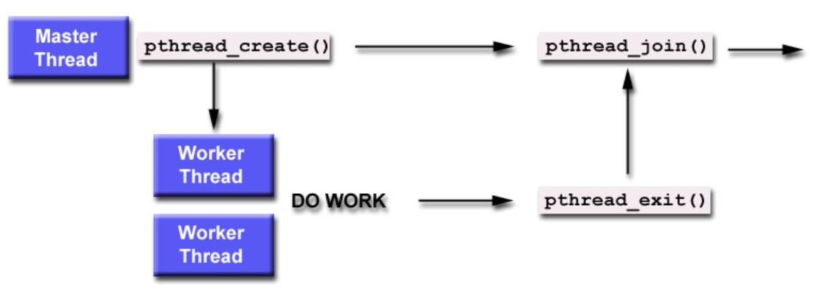

# Ch2-2 Linux多核编程

## Linux进程

### C程序的入口
* crt0.o：此文件中的内容是固定的，在这里调用main函数，因此main函数返回之后还能进行一些处理工作。
* cc/ld时自动链接。
* main函数原型：

```C++
int main (int argc char *argv[]);
```

### exec系列函数

#### 介绍
* exec系列函数都用于启动一个新程序，切换到新的上下文。
* 废弃原程序的数据段堆栈段，为新程序分配新的数据段和堆栈段，仅有进程号不变，返回后继续执行原来的任务。
* 返回值为当前进程号（不变）。

#### 函数原型
    #include <unistd.h>
    
    int execl (const char *path, const char *arg0, ..., (char *)0);
    int execlp (const char *file, const char *arg0, ..., (char *)0);
    int execle (const char *path, const char *arg0, ..., (char *)0, char *const envp[]);
    int execv (const char *path, char *const argv[]);
    int execvp (const char *file, char *const argv[]);
    int execve (const char *path, char *const argv[], char *const envp[]);

* 带l的exec：参数可变。
* 带p的exec：第一个参数是文件名。
* 带e的exec：可以修改当前的环境变量。

### fork函数

#### 介绍
* 执行fork后有两个线程执行同一段代码。
* 原进程的返回值为新进程的PID；新进程的返回值为0。

#### 函数原型
    #include <sys/tyoes.h>
    #include <unistd.h>
    
    pid_t fork();
  
#### 使用范例
```C++
if (fork()==0) {
    // 子进程代码段
} else {
    // 父进程代码段
}
```

### 结束进程

#### 正常退出
* 从main函数返回。
* 调用`exit`函数或`_exit`函数。
    * `exit`是C库函数，`_exit`是系统调用，其函数原型如下：

            #include <stdlib.h>
            void exit (int status);
            #include <unistd.h>
            void _exit (int status);
    
    * `_exit`更贴近底层，可以立即结束一个进程，而`exit`还会做一些清理工作（调用各种终止处理程序，清理标准I/O，最终才调用`_exit`）。
* 终止处理程序：可以自行编写，使用`atexit`函数，意思是注册一个在程序正常退出时执行的程序，本质上是注册处理程序的入口地址。

        #include <stdlib.h>
        int atexit (void (*function) (void));

* 多线程程序的最后一个线程退出。

#### 非正常结束
* 调用`abort`函数。
* 收到`kill`信号。
* 最后一个线程被取消。

### wait()与waitpid()

#### 使用背景
* 主要用于父子进程之间，等待进程结束。
* Linux下每个进程在执行完毕后并不立即回收，只有在其父进程调用wait()/waitpid()时才会将其资源释放出来。

#### 函数原型
    #include <sys/types.h>
    #include <sys/wait.h>
    pit_t wait (int *status); // 等待任意一个子进程结束。
    pid_t waitpid (pid_t pid, int *status, int options); // 等待指定pid的子进程结束。

#### 参数含义
* status是输出参数，用于收集被等待进程的返回值等信息。
* options可以使waitpid非阻塞，置为`WNOHANG`即可，即调用的时候地看一下当前是否存在符合条件的僵尸进程，看完立即返回。
* 返回值是寻找到的僵尸进程的pid，如果pid不存在则返回-1。
* waitpid()的pid参数：
    * -1：waitpid()此时退化为wait()，等待任一子进程结束。
    * >0：等待对应PID的子进程。
    * =0：等待与当前进程同组的子进程。
    * <0：此参数的绝对值代表进程组组号，等待对应进程组的子进程。

## Linux信号

### 信号的概念
* 信号本质上是一个软中断，提供了处理异步事件的机制。
* 每个信号都有以SIG开头的名字，信号被定义为正整数（在<signal.h>中）。
  
### 产生信号的方法
* 按终端键，如Ctrl+C -> SIGINT。
* 硬件异常，如内存错误 -> SIGSEGV。
* kill(2)函数。
* kill(1)命令。
* 软件条件：某种软件条件已经发生，并应将其通知有关进程->SIGALARM。

### 系统预定义的信号
> Linux支持的所有信号可以通过`man 7 signal`进行查询。

| 名称 | 说明 |
| --- | --- |
| SIGABRT | 进程异常终止（调用abort函数产生此信号） |
| SIGALRM | 超时（alarm） |
| SIGFPE | 算术运算异常（除0、浮点溢出等） |
| SIGHUP | 连接断开 |
| SIGILL | 非法硬件指令 |
| SIGINT | 终端中断符（Ctrl+C） |
| SIGKILL | 终止（不能被捕捉或忽略） |
| SIGPIPE | 向没有读进程的管道写数据 |
| SIGQUIT | 终端退出符（Ctrl+\） |
| SIGTERM | 终止（由kill命令发出的系统默认终止信号） |
| SIGUSR1 | 用户定义信号 |
| SIGUSR2 | 用户定义信号 |
| SIGSEGV | 无效存储访问（段异常） |
| SIGCHLD | 子进程停止或退出 |
| SIGCONT | 使暂停进程继续 |
| SIGSTOP | 停止（不能被捕捉或忽略） |
| SIGTSTP | 终端挂起符（Ctrl+Z） |
| SIGTTIN | 后台进程请求从控制终端读 |
| SIGTTOUT | 后台进程请求从控制终端写 |

### 信号的处理方式
* 忽略信号（SIGKILL、SIGSTOP等严重错误不能被忽略）
* 执行系统默认动作
* 捕捉信号

### signal函数：捕捉信号的处理函数
    #include <signal.h>
    typedef void (*sighandler_t) (int);
    sighandler_t signal (int signum, sighandler_t handler);
    
* 如果函数调用成功，则返回之前的信号处理函数。
* 如果出错，则返回SIG_ERR。
* handler参数：
    * 用户定义的函数
    * SIG_DEF（默认信号处理）
    * SIG_IGN（忽略）
* 使用示例：

```C++
static void sig_usr (int);

int main() {
    if (signal(SIGUSR1, sig_usr)==SIG_ERR)
        err_sys("can't catch SIGUSR1");
    if (signal(SIGUSR2, sig_usr)==SIG_ERR)
        err_sys("can't catch SIGUSR2");
    // continue...
}
```

### 信号的可靠性
* 信号有可能在到达激活的响应函数前被丢弃。
* 现代Linux将信号分为可靠信号和不可靠信号，SIGRTMIN（通常为32）被认为是不可靠信号，其它的是可靠信号。
* 不可靠信号可能会丢失，如多个信号同时到达时，只收到第一个到达的信号，其他的信号全部丢失。
* 线程十分忙时收到信号，信号也可能丢失。
* 信号的复位机制：捕捉信号并处理后，响应函数立即被重置，改回原有的默认函数，如果还需要继续处理，就要在处理函数中重新注册一次。

### 中断系统调用
* 低速系统调用在接受到信号时会被中断。
* 此时返回出错，errno=EINTR。
* 解决方法示例：

```C++
again:
if ((n==read(fd, buf, BUFFSIZE))<0) {
    if (errno==EINTR) // just an interrupted system call
        goto again;
    // Handle other errors
}
```

### 可重入函数和不可重入函数
* 二者区别：可重入函数就是可以被中断的函数，不可重入函数就是不能被中断的函数。
* 不可重入函数：
    * 系统资源。
    * 全局变量诸如++、--之类的非原子操作。
    * 使用静态数据结构。
    * 调用malloc或free。
    * 标准I/O函数。
* 使用说明：尽量不要在信号处理函数中使用不可重入函数，可能有一定概率出错。这是因为主函数无法控制信号产生的时机，因而调用这些不可重入函数的中间状态不可预料，从而对内核产生不可预料的影响。

### 发送信号
发送信号有权限要求，低权限用户不能向高权限用户进程发送信号，root可以给所有进程发信号。

#### kill(2)：向一个指定进程发送信号
    #include <sys/types.h>
    #include <signal.h>
    
    int kill (pid_t pid, int sig);

* 可以使用`kill`发送任何信号。
* pid一样可以多样取值，和waitpid相同。
* 成功返回0，失败返回-1。

#### raise(3)：向当前的进程（自己）发送信号
    #include <signal.h>
    
    int raise (int sig);

* 成功返回0，失败返回-1。

#### alarm：过一段时间向自己发送SIGALARM信号（类似闹钟）
    #include <unistd.h>
    
    unsigned int alarm (unsigned int seconds);

* alarm主要用于对可能阻塞的操作做时间限制。
* 没有设定处理函数时，默认行为为退出。
* 连续发送SIGALARM信号时，最新的alarm将替换掉原有的，返回值为上次调用的剩余倒计时；第一次调用时返回0；调用失败返回-1。

#### pause：停下来等待一个信号
	#include <unistd.h>

	int pause (void);

* 返回-1，并且errno被设置为EINTR。
	
#### 使用alarm与pause来实现sleep
```C++
void sig_alarm (int signo) {
    printf("alarm received.\n");
}

unsigned int sleep1 (unsigned int nsecs) {
    if (signal(SIGALARM, sig_alarm)==SIG_ERR)
        return nsecs;
    alarm(nsecs);
    pause();
    return alarm(0); // 将闹钟清零从而取消掉
}
```

## 可靠信号机制

### 信号集（信号的集合）
    #include <signal.h>

    int sigemptyset (sigset_t *set);
    int sigfillset (sigset_t *set);
    int sigaddset (sigset_t *set, int signum);
    int sigdelset (sigset_t *set, int signum);
    // 以上四个函数成功返回0，出错返回-1。
    int sigismember (xonst sigset_t *set, int signum);
    // 该函数成功返回返回1，出错返回0。

### 信号掩码
	#include <signal.h>

	int sigprocmask (int how, const sigset_t *set, sigset_t *oldset);
	// 成功返回返回0，出错返回-1。

* 用于检测或更改进程的信号掩码。
* 参数oldset将返回原有的信号集。
* 参数how有三种：
    * SIG_BLOCK：将信号并入掩码。
    * SIG_UNBLOCK：在掩码中除去相应的信号。
    * SIG_SETMASK：直接替换。
* 在sigprocmask调用后，任何未阻塞并且pending的信号，在函数返回前，至少有一个信号会送达进程。
* 所有信号集内的信号都会被屏蔽，但将会被置为pending，更多相同类型的信号将被丢弃。
* 被屏蔽的信号重新打开时，信号将被处理，并且一定在sigprocmask返回之前被处理
* 注意：这两个信号SIGKILL、SIGSTOP无法被阻塞。
  
### sigpending()
返回当前未决的信号集，成功返回返回0，出错返回-1。

    #include <signal.h>
    int sigpending (sigset_t *set);
    // 输出参数set用来输出信号集。

### sigaction()
用于检查或修改（或两者）与指定信号关联的处理动作，类似系统调用signal，成功返回返回0，出错返回-1。

    #include <signal.h>
    
    int sigaction (int signum, const struct sigaction *act, struct sigaction *oldact);
	
* sigaction中的屏蔽字仅在执行信号处理函数期间生效，当前正在响应的信号被默认直接屏蔽，不需设置。
* sa_flags可以有多种设定参数。

### sigsuspend()
用sigmask临时替换信号掩码，在捕捉一个信号或发生终止进程的信号前，进程挂起，成功返回返回0，出错返回-1。

    #include <signal.h>
    int sigsuspend(const sigset *sigmask);

* 等待信号时，信号可以是之前pending的，也可以是在等待过程中出现的。
* 等待结束后，信号掩码仍然恢复到原先的设定。

## 共享内存
* 共享内存是内核为进程创建的特殊内存段，它可以连接到自己的地址空间，也可以连接到其它进程的地址空间。
* 是最快的进程间通信方式，但不提供任何同步功能。
* 线程共享内存的存储位置一定在内核的内核态。

## POSIX线程（pthread）

### 配置编程环境
* pthread库：
    * /usr/lib/libpthread.so
    * /usr/lib/libpthread.a
* pthread.h头文件：/usr/include/pthread.h
* 编译选项：gcc thread.c -o thread -lpthread

### 线程的创建和结束

#### 创建线程
    #include <pthread.h>
    
    int pthread_create (
        pthread_t *thread,
        pthread_attr_t *attr,
        void *(start_routine) (void *),
        void *arg
    );

#### 结束当前线程
    #include <pthread.h>
    
    void pthread_exit (void *retval);
    
### Joinable与Detached线程


    int pthread_join (pthread_t th, void **thread_return);
    int pthread_detach (pthread_t th);

* 主线程默认等待所有子线程结束后才结束。
* 如果要关闭这一特性，需要将子线程设定为Detached。
* Linux下线程没有严格的主次之分。

### 线程同步

#### 信号量（Semaphore）
    #include <semaphore.h>

    int sem_init (sem_t *sem, int pshared, unsigned int value);
    int sem_wait (sem_t *sem);
    int sem_post (sem_t *sem);
    int sem_destroy (sem_t *sem);
    int sem_trywait (sem_t *sem);
    int sem_getvalue (sem_t *sem, int *sval);

* sem_trywait在信号量为0时，不会阻塞等待而立即失败返回，返回值为`EAGAIN`。

#### 互斥量（Mutex）
    #include <pthread.h>
    
    int pthread_mutex_init (pthread_mutex_t *mutex, const pthread_mutexattr_t *mutexattr);
    int pthread_mutex_lock (pthread_mutex_t *mutex);
    int pthread_mutex_unlock (pthread_mutex_t *mutex);
    int pthread_mutex_destroy (pthread_mutex_t *mutex);
    int pthread_mutex_trylock (pthread_mutex_t *mutex);

* 静态初始化：`PTHREAD_MUTEX_INITIALIZER`
* 动态初始化：`pthread_mutex_init()`

#### 条件变量（Conditional Variable，CV）
* 全局可见，可被多个线程访问。
* 检查条件是否被满足，基于轮询或类似于Windows的事件机制。
* 条件变量常与互斥量一同使用。
* 条件变量必须声明为pthread_cond_t类型，并且必须在使用之前进行初始化。
* 条件变量提供了unlock与wait的复合原子操作，多线程的互斥全部可以应用此模式。

##### 初始化条件变量
```C++
// 静态初始化
pthread_cond_t convar = PTHREAD_COND_INITIALIZER;
// 注：一个宏并不只对应一个条件变量，可以被多次调用。

// 动态初始化
int pthread_cond_init (
    pthread_cond_t *cond,
    pthread_condattr_t *cond_attr
);
// 第二个参数在很多库里没有被实现，直接提供NULL即可。
```

> 静态初始化的条件变量不需要释放，但动态初始化的要销毁。

##### 销毁条件变量
```C++
int pthread_cond_destroy (pthread_cond_t *cond);
```

##### 等待、通知、广播
```C++
int pthread_cond_wait (pthread_cond_t *cond, pthread_mutex_t *mutex);
int pthread_cond_timedwait (pthread_cond_t *cond, pthread_mutex_t &mutex, time_t *timeout);
int pthread_cond_signal (pthread_cond_t cond);
int pthread_cond_broadcast (pthread_cond_t cond);
```

* wait操作必须在互斥量锁上时调用，调用之后在等待过程中会自动释放互斥量，在被唤醒时互斥量又会被自动锁上，因此最终一定要手动再释放一次互斥量。
* signal操作必须在互斥量锁上时调用，用来通知处于等待状态的一个随机条件变量，但无法控制具体是哪个，调用完之后需要为wait操作锁定互斥量。
* broadcast操作将唤醒所有处于等待状态的条件变量。

##### 使用模式
* 主线程：
    1. 声明并初始化需要同步的全局数据和变量
    2. 声明并初始化条件变量对象
    3. 声明并初始化相关的互斥量
    4. 创建工作线程
    5. 等待并继续
* 工作线程1：
    1. 工作，直到满足一个特定的条件
    2. 锁上对应的互斥量并检查全局数据的值
    3. 等待条件变量（此时互斥量自动解锁）
    4. 手动地锁上互斥量
    5. 继续工作
* 工作线程2：
    1. 工作
    2. 锁住相关的互斥量
    3. 改变全局数据的值
    4. 检查被等待的全局数据的值，如果满足条件，唤醒一个工作线程1
    5. 解锁信号量
    6. 继续工作

### 线程属性对象（pthread_attr_t）

#### 初始化
    #include <pthread.h>
    
    int pthread_attr_init (pthread_attr_t *attr);

#### get/set族函数
```C++
int pthread_attr_setdetachstate (pthread_attr_t *attr, int detachstate);
int pthread_attr_getdetachstategetdetachstate (const pthread_attr_t *attr, int *detachstate);

int pthread_attr_setschedpolicy (pthread_attr_t *attr, int policy);
int pthread_attr_getschedpolicy (const pthread_attr_t *attr, int *policy);

int pthread_attr_setschedparam (pthread_attr_t *attr, int param);
int pthread_attr_getschedparam (const pthread_attr_t *attr, int *param);
```

* detachstate：线程分离，可传入`PTHREAD_CREATE_JOIN`或`PTHREAD_CREATE_DETACHED`。
* schedpolicy：调度策略，可传入`SCHED_OTHER`、`SCHED_RR`或`SCHED_FIFO`，后两个都是实时调度策略。
* schedparam：调度参数，主要是优先级。

### 终止线程
```C++
int pthread_cancel (pthread_t thread);
int pthread_setcancelstate (int state, int *oldstate);
int pthread_setcanceltype (int type, int *oldtype);
```

* setcancelstate操作用于设置是否理会其它线程的cancel，可传入的state参数为`PTHREAD_CANCEL_ENABLE`或`PTHREAD_CANCEL_DISABLE`。
* setcanceltype操作用于设置中止的时间点，可传入的type参数为`PTHREAD_CANCEL_ASYNCRONOUSD`（立即退出）或`PTHREAD_CANCEL_DEFFERD`（延迟退出）。

### 多线程程序容易出现的错误
* 共享变量取法保护（未互斥使用）。
* 创建线程时传递指针，指针指向的变量可能是共享的。

### 线程局部存储（Thread Local Storage，TLS）
```C++
int pthread_key_create (pthread_key_t *key, void (*destructor) (void*));
int pthread_key_delete (pthread_key_t key);
void* pthread_getspecific (pthread_key_t key);
int pthread_setspecific (pthread_key_t key, const void *value);
```

* 与Windows的TLS不同之处在于，存入和取出的内容明确为void*类型。
* 可以明确地指定传入数据的析构函数，用于对存入的指针指向的内容进行释放，这里的析构函数在对应线程执行结束后自动执行。
* 释放key时并不会释放key指向的内容，因此这里一定要手动进行释放。

