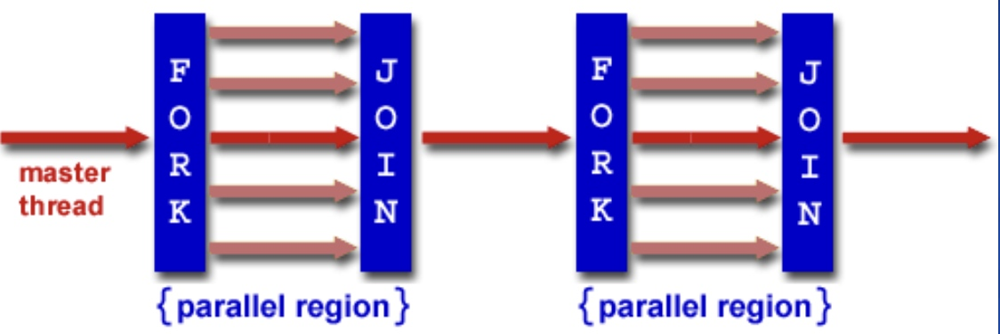
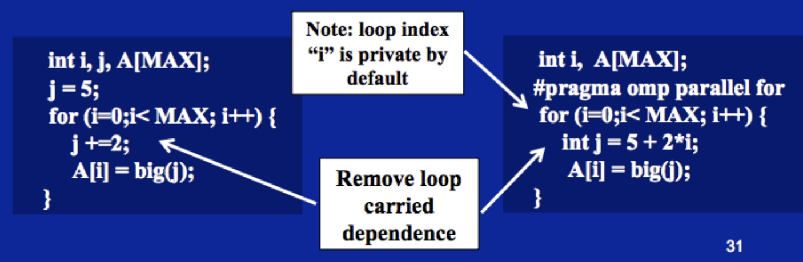
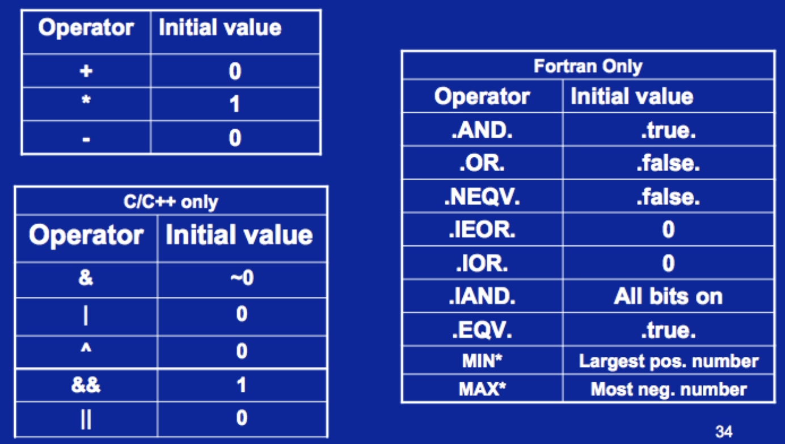

# Ch2-3 OpenMP多核编程

## OpenMP的介绍

### 概览
* 提供线程级别的基于共享内存的并行模型。
* 多线程实现的物理结构是SMP。
* 本身只是提供一种规范，具体的实现由各个系统和编译器负责实现。

### OpenMP的实现层次
* 编译指导（Compiler Directives）
* 运行时库函数（Runtime Library Routines）
* 环境变量（Environment Variables）

### OpenMP的目标
* 标准化：在不同的语言和架构上都可以以相同的方式编写多核程序。
* 简洁有效：编译器的指导语句尽可能地少。
* 易用性：允许程序逐步并行化，使对串行程序的修改尽可能地少。
* 可移植性：多种语言、不同平台。

### OpenMP的编程模型
* 共享内存、基于线程的并行模型
* 显式并行
* Fork-Join模型：程序启动后是单线程，达到需要并行的部分（并行区）时，产生多个线程同时运行，所有线程同时执行完后互相等待，一起结束。
* 编译指导（Compiler Directive Based）
* 嵌套并行（Nested Parallelism Support）
* 动态线程的创建与销毁：线程的数量可以由OpenMP自适应。
* I/O：OpenMP并没有指定I/O的接口，仍然按原有的方式进行读写，因此并行区中的读写会面临冲突的问题，需要程序员自己解决。
* 内存模型

### 编程注意事项
* 编译器命令选项：
    * gcc：`-fopenmp`
    * pgi：`-mp`
    * intel：`/Qopenmp`
    * VS：`/openmp`，或直接在项目属性中添加OpenMP支持
* `#include <omp.h>`

## 创建线程

### Fork-Join模型
* 主线程根据需要创建一组线程执行并行任务，创建后就进入了并行区。
* 在并行区中，主线程作为其中一个线程。
* 并行区可以嵌套，并且在子并行区中，仍有相应概念上的主线程。



### 编译指导语句：创建线程，进入临界区
    #pragma omp parallel
    {
    
    }

### 指定线程个数
    // 库函数：此函数之后的每个并行区都是4个线程同时运行。
    omp_set_num_threads(4);
    
    // 编译指导语句：只对一个并行区生效。
    #pragma omp parallel num_threads(4)
    {
        // 并行区
    }

* 如果不指定线程个数，默认线程个数为当前处理器数或处理器核心数。
	
## 线程同步（Synchronization）

### 高层同步

#### 临界区（critical）：同一时刻只有一个线程能进入临界区
    float res;
    #pragma omp parallel
    {
        float B;
        int i, id, nthrds;
        id = omp_get_thread_num(); // 当前线程的ID
        nthrds = omp_get_num_threads(); // 当前的线程个数
        for (i=id; i<niters; i+=thrds) {
            B = big_job(i);
            #pragma omp critical // 表示临界区
            consume(B, res);
        }
    }

#### 原子操作（atomic）：不会被其他线程打断
    #pragma omp parallel
    {
        double tmp, B;
        B = DOIT();
        tmp = big_ugly(B);
        #pragma omp atomic // 表示原子操作
        X += tmp;
    }

* 原子操作中不能使用复合语句，也不能进行函数调用。
* 原子操作的效率比临界区高很多，因为可以调用一些系统底层的特殊功能来实现。

#### 路障同步（barrier）：等待直到所有线程到达
    #pragma omp parallel shared (A, B) private (id)
    {
        id = omp_get_thread_num();
        A[id] = big_calc1();
        #pragma omp barrier // 手动的路障同步
        #pragma omp for
        for (int i=0; i<N; i++) {
            B[i] = big_calc2(i, A);
        }
        #pragma omp for nowait // 取消for循环末尾的隐式路障同步，可同样用于其他在出口处有隐式路障同步的worksharing结构。
    }

#### 顺序同步（ordered）：按照一定顺序执行。
    #pragma omp parallel private (tmp)
    {
        #pragma omp for ordered reduction (+:res)
        for (i=0; i<N; i++) {
            tmp = NEAT_STUFF(i);
        #pragma ordered
            res += consum(tmp);
        }
    }

* 只能加在for循环后，按照for循环的串行迭代序执行。
* 对性能影响很大。

### 低层同步

#### flush：迫使数据在内存更新以便其他线程可以看到最新值
    double a;
    a = compute();
    flush(a); // 方法一：库函数
    #pragma omp flush(a) // 方法二：编译指导语句

* 隐式flush：
    * 路障同步
    * 加锁解锁和锁的test操作
    * 并行区、临界区、原子操作、顺序同步的入口和出口
    * 所有worksharing的出口（除非有nowait）

#### 锁（locks）

##### 简单锁：可以认为是简单的布尔变量
```C++
omp_lock_t lock;

omp_init_lock(&lock);
omp_set_lock(&lock);
omp_unset_lock(&lock);
omp_test_lock(&lock);
omp_destroy_lock(&lock);
```

##### 嵌套锁：可以被同一个进程加锁多次，解锁时也要进行相应数量的解锁
```C++
omp_lock_t lock;

omp_init_nest_lock(&lock);
omp_set_nest_lock(&lock);
omp_unset_nest_lock(&lock);
omp_test_nest_lock(&lock);
omp_destroy_nest_lock(&lock);
```

##### 使用举例
    #include <omp.h>
    omp_lock_t lock;
    omp_init_lock(&lck);
	
    #pragma omp parallel private(tmp, id)
    {
        id = omp_get_thread_num();
        tmp = do_lots_of_work(id);
        omp_set_lock(&lock);
        omp_unset_lock(&lock);
    }
    omp_destroy_lock(&lock);

## 并行循环（Parallel Loop）

### SPMD与worksharing
* SPMD：Single Program Multiple Data，多个线程基于不同的数据集执行相同代码。
* worksharing：将代码定义的任务分成不同部分，交给多个线程来完成。

### worksharing的种类

#### 循环结构（for循环）
    #pragma omp parallel
    {
        // for的编译指导语句必须写在临界区内
        #pragma omp for
        for (i=0; i<N; i++) {
            something();
        }
    }
    
    // 也可以这样写
    #pragma omp parallel for
    for (i=0; i<N; i++) {
        something();
    }

* `i`将自动成为每个线程的私有变量。
* for循环默认采用的是横切，即：{0,1,2,3}，{4,5,6,7}，...
* 在C/C++中名称是`for`，在Fortran中名称是`do`。

#### single和master结构
    // single示例
    #pragma omp parallel
    {
        do_many_things();
        #pragma omp single
        {
            exchange_boundaries();
        }
        #pragma omp single nowait // 去掉single出口的隐式路障同步。
    }
    
    // master示例
    #pragma omp parallel
    {
        do_many_things();
        #pragma omp master
        {
            exchange_boundaries();
        }
        #pragma omp barrier // 在master出口显式添加路障同步。
    }

* single是worksharing结构，master不是，因此master的出口没有隐式路障同步。
* single和master都只将任务分配给一个线程，不同之处在于master只会把任务分配给master线程。

#### section结构
    #pragma omp parallel
    {
        #pragma omp sections
        {
            #pragma omp section
            calculation1();
            #pragma omp section
            calculation2();
            #pragma omp section
            calculation3();
        }
    }

* section结构定义了需要分配给线程的任务，由系统自由分配给不同线程运行。
    * 任务数=线程数时，分配显然。
    * 任务数>线程数时，先用任务把线程占满，执行完的线程再被分配剩下的任务。
    * 任务数<线程数时，其它线程等待。
* section结构出口处有一个隐式路障同步，可以用nowait来关闭。

#### task（3.0或更高版本）

### worksharing的特点
* worksharing结构不创建线程，只把任务分配给创建好的线程。
* worksharing结构的入口没有路障同步，但出口有隐式路障同步。
* 待分配的任务无法执行一部分，要么整个分配，要么不分配。
* 分配时有固定的次序，不支持自定义的次序，也不会随机分配。

### 消除循环的数据依赖


### 规约（Reduction）

#### 基本格式
    double ave = 0.0, A[MAX];
    int i;
    #pragma omp parallel for reduction (+:ave)
    for (i=0; i<MAX; i++) {
        ave += A[i];
    }
    ave /= MAX;

#### 操作符和初始值


## OpenMP的库函数和环境变量

### 库函数
```C++
// 线程数量相关函数
omp_set_num_threads(int); // 设置线程数
omp_get_num_threads(); // 获取当前并行区的线程数
omp_get_max_threads(); // 获取下一次开并行区的线程数
omp_get_thread_num(); // 获取当前线程ID

// 判断是否在并行区中
omp_in_parallel();

// 是否允许系统动态调整线程数量
omp_get_dynamic();
omp_set_dynamic(int);

// 获取系统处理器数量
omp_num_procs();
```

### 环境变量
* `OMP_NUM_THREADS`：设置默认线程数，默认为当前处理器个数。
* `OMP_SCHEDULE`：设置循环中任务如何分配给线程。
* 环境变量的优先级比库函数低，会被库函数覆盖。

## 数据环境

### 默认存储属性
* 公有：全局变量、静态变量、堆内存。
* 私有：并行区内定义的变量。

### 五种数据共享权限

#### SHARED
* 线程间共享的变量。
* 不需要创建新变量和复制操作，直接使用全局变量。

#### PRIVATE
* 每个线程都有一个private变量的copy。
* 临界区执行过程中，master线程中的private变量使用外部变量的存储空间，但临界区结束后外部变量会变回未定义的值。
* private变量的初值未定义，所以进入临界区后要手动定义初值。

#### FIRSTPRIVATE
* 和PRIVATE几乎相同。
* 初值定义为进入临界区前的值。

#### LASTPRIVATE
* 和PRIVATE几乎相同。
* 出并行区时，全局变量的值将被改变为最后一条执行完成的线程中private变量的值。

#### DEFAULT
* 设置默认的数据共享权限，格式为：`default(PRIVATE|SHARED|NONE)`
* `SHARED`是默认存在的，因此不需写出来。`#pragma omp task`除外，它默认是FIRSTPRIVATE的。
* C/C++不支持`PRIVATE`，只有Fortran支持。
* `NONE`将不为变量设定默认值，此时必须为每个变量显式指定属性。

#### THREADPRIVATE
* 和PRIVATE几乎相同。
* 将全局变量的值复制给所有线程的private变量，可以穿越多个并行区。
* 各线程的最后的结果不写回全局变量。

### 数据复制
* COPYIN：用来初始化THREADPRIVATE变量。
* COPYPRIVATE：只能在single结构中使用，在路障同步点处由执行single的线程拷贝到所有其它线程。
* 不能把私有变量的指针作为共享变量在线程间传递，会造成不可预料的后果。

## 任务调度

### section结构
同上。

### schedule函数
```C++
schedule (static[, chunk]); // 静态调度
schedule (dynamic[, chunk]); // 动态调度
schedule (guided[, chunk]); // guided调度
schedule (runtime); // 运行时调度
```  

* 参数chunk是指：打包chunk个迭代的任务分配给一个线程，默认为最大值（迭代数／线程数）。如果需要循环纵切，chunk设置为1即可。
* 静态调度（默认情况）：在编译时静态分配的调度，哪些任务分给哪个线程。
* 动态调度：运行时动态分配的调度。
* guided调度：动态调度的升级版，打包迭代任务的数量从chunk逐渐降低。
* 运行时调度：chunk的值由环境变量`OMP_SCHEDULE`决定。
* 实际上大多数编译器只实现了static，另外三种都没实现。

## 内存模型：顺序一致性（弱一致性）
* 指令重排：在代码中，读写顺序在不改变语义的情况下是可以改变的。
* 顺序一致性：OpenMP中保证如下5个顺序不会被改变：S->W、S->R、R->S、W->S、S->S。
* 在这里S代表Synchronization，相关操作为flush。

## OpenMP 3.0与Tasks

### OpenMP 3.0的特点
* 提供task指令：可以动态分配任务给线程。
* 提供对嵌套并行更好的支持。
* 轻便的线程控制：增加环境变量以控制子线程栈大小和在运行时处理空闲线程。

### task指令

#### 特点
* task = 需要执行的代码 + 独立的数据环境 + 分配的线程
* task包括打包任务和把任务分配给空闲的线程执行，这个分配任务由master线程完成。

#### 用法
    #pragma omp task [clause[[,],clause] ...]

* clause参数可以为：
    * `if (expression)`：当expression为`true`时才执行。
    * `untied`：创建的任务默认将会与某个线程绑定，即只能由该线程来完成，但`untied`可以用来解除这样的绑定，它允许任务的创建和分配交给其他线程而不是master线程来做。
    * `shared (list)`
    * `private (list)`
    * `firstprivate (list)`
    * `default (shared|none)`

#### 举例
    #pragma omp parallel
    {
        #pragma omp single private(p)
        // 由一个线程进行预处理，其它线程什么都不做。
        {
            p = listhead;
            while (p) {
                #pragma omp task
                process(p);
                p = next(p);
            }
        }
    }

### 新引入的库函数和环境变量
```C++
omp_get_active_level(); // 获取当前嵌套区的层数
omp_get_ancestor (int); // 获取对应参数层数的嵌套区的父线程ID
omp_get_teamsize (int); // 获取对应参数层数的嵌套区的线程数

OMP_STACKSIZE // 环境变量：子线程的栈大小
OMP_WAIT_POLICY // 环境变量：线程遇到锁／路障时的等待策略，有两个选择，一个是ACTIVE（先自旋一段时间），另一个是PASSIVE（直接阻塞）。

OMP_MAX_ACTIVE_LEVELS // 环境变量：嵌套并行区的最大层数
omp_set_max_active_levels (int); // 设置嵌套并行区的最大层数
omp_get_max_active_levels (); // 获取嵌套并行区的最大层数

OMP_THREAD_LIMIT // 环境变量：最大可用线程数
omp_get_thread_limit(); // 获取最大可用线程数
```


