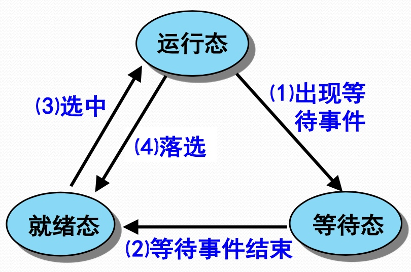
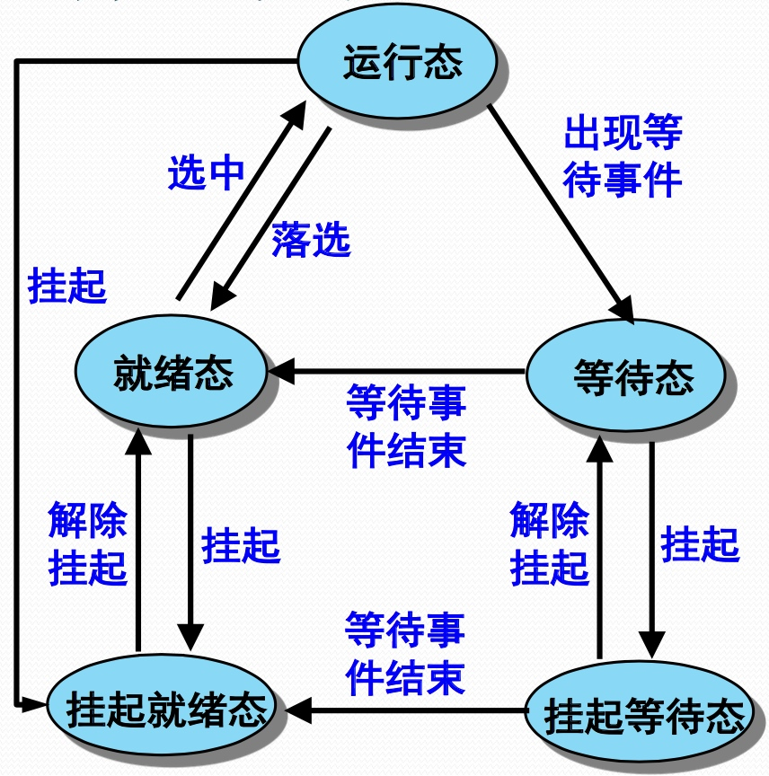
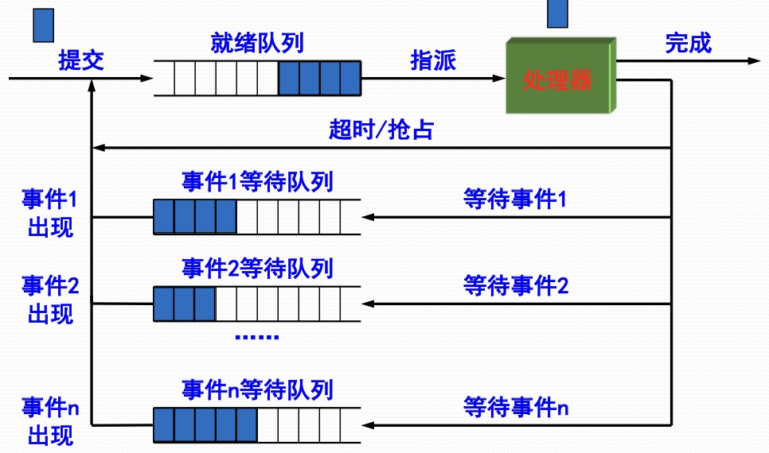

# 进程管理

## 进程

### 进程的概念
* 进程是一个具有一定独立功能的程序关于某个数据集合的一次运行活动。
* 进程是操作系统进行资源分配和调度的一个独立单位。

### 进程的状态与转换
* 三态模型

* 五态模型

### 进程的控制
* 进程控制块（Process Control Block，PCB）：是一个OS用于记录和刻画进程状态及环境信息的数据结构，包括三个部分：标示信息、现场信息和控制信息。
* 进程映像（Process Image，PI）：是某一时刻进程的内容及其执行状态集合，是内存级的物理实体，包括四个部分：进程控制块、进程程序块、进程数据块和核心栈。
* 进程上下文（Process Context，PC）：是进程执行需要的环境支持，由OS中的进程物理实体和支持进程运行的环境组成，包括三个部分：用户级上下文、寄存器上下文和系统级上下文。

### 进程的组织（进程队列模型）

### 进程间通信方式
* 消息队列（MessageQueue）：消息队列是由消息的链表，存放在内核中并由消息队列标识符标识。
* 共享内存（SharedMemory）：共享内存就是映射一段能被其他进程所访问的内存，这段共享内存由一个进程创建，但多个进程都可以访问。共享内存是最快的IPC方式，它是针对其他进程间通信方式运行效率低而专门设计的。它往往与其他通信机制，如信号两，配合使用，来实现进程间的同步和通信。
* 管道（Pipe）：管道是一种半双工的通信方式，数据只能单向流动，而且只能在具有亲缘关系的进程间使用。进程的亲缘关系通常是指父子进程关系。
* 信号量（Semaphore）：信号量是一个计数器，可以用来控制多个进程对共享资源的访问。它常作为一种锁机制，防止某进程正在访问共享资源时，其他进程也访问该资源。因此，主要作为进程间以及同一进程内不同线程之间的同步手段。
* 套接字（Socket）：套接字也是一种进程间通信机制，与其他通信机制不同的是，它可用于不同机器间的进程通信。
* 信号（Signal）：信号是一种比较复杂的通信方式，用于通知接收进程某个事件已经发生。

## 线程

### 线程概念与多线程模型
* 线程是进程的一条执行路径，是调度的基本单位，同一个进程中的所有线程共享进程获得的主存空间和资源。
* 进程是执行着的应用程序，而线程是进程内部的一个执行序列。
* 一个进程可以有多个线程。

### 线程的上下文切换及其开销
* 线程的上下文切换是指：当一条线程的时间片用完后，操作系统会暂停该线程，并保存该线程相应的信息，然后再选择另一条线程去执行。
* 每次进行上下文切换时都需要保存当前线程的执行状态，并加载新线程先前保存的状态。所以如果上下文切换频繁，CPU花在上下文切换上的时间占比就会上升，而真正处理任务的时间占比就会下降。因此，为了提高并发程序的执行效率，让CPU把时间花在刀刃上，我们需要减少上下文切换的次数。

### 如何减少上下文切换
* 减少线程的数量：最简单的做法，只要减少线程的数量，就能减少上下文切换的次数。然而如果线程数量已经少于CPU核数，每个CPU执行一条线程，照理来说CPU已经不需要上下文切换了，但事实并非如此。
* 减少同一把锁上的线程数量：如果多条线程共用同一把锁，那么当一条线程获得锁后，其他线程就会被阻塞，就会出现上下文切换；当该线程释放锁后，操作系统会从被阻塞的线程中选一条执行，从而又会出现上下文切换。因此，减少同一把锁上的线程数量也能减少上下文切换的次数。
* 采用无锁并发编程
    * Hash分段（需要并发执行的任务是无状态的）：所谓无状态是指并发执行的任务没有共享变量，他们都独立执行。对于这种类型的任务可以按照ID进行Hash分段，每段用一条线程去执行。
    * CAS算法（需要并发执行的任务是有状态的）：如果任务需要修改共享变量，那么必须要控制线程的执行顺序，否则会出现安全性问题。你可以给任务加锁，保证任务的原子性与可见性，但这会引起阻塞，从而发生上下文切换。为了避免上下文切换，你可以使用CAS算法，仅在线程内部需要更新共享变量时使用CAS算法来更新，这种方式不会阻塞线程，并保证更新过程的安全性。

### 线程间通信方式
* 共享内存
    * 共享内存是指：多条线程共享同一片内存，发送者将消息写入内存，接收者从内存中读取消息，从而实现了消息的传递。
    * 但这种方式有个弊端，即需要程序员来控制线程的同步，即线程的执行次序。
    * 这种方式并没有真正地实现消息传递，只是从结果上来看就像是将消息从一条线程传递到了另一条线程。
* 消息队列
    * 顾名思义，消息传递指的是发送线程直接将消息传递给接收线程。
    * 由于执行次序由并发机制完成，因此不需要程序员添加额外的同步机制，但需要声明消息发送和接收的代码。

### 线程池
* 如果并发的线程数量很多，并且每个线程都是执行一个时间很短的任务就结束了，这样频繁创建线程就会大大降低系统的效率，因为频繁创建线程和销毁线程需要时间。
* 我们知道线程能共享系统资源，如果同时执行的线程过多，就有可能导致系统资源不足而产生阻塞的情况。运用线程池能有效的控制线程最大并发数，避免以上的问题。
* 线程池是指：提供一个容器，使得线程可以复用，就是执行完一个任务后不会被销毁，而是可以继续执行其他任务。

## 处理机调度

### 调度的基本概念
* 高级调度：高级调度又称为作业调度或长程调度，其主要功能是根据某种算法，把外存上处于后备队列中的那些作业调入内存，也就是说，它的调度对象是作业。
* 中级调度：中级调度又称中程调度。引入中程调度的主要目的是为了提高内存利用率和系统吞吐量。中级调度实际上就是存储器管理中的对换功能。
* 低级调度：低级调度通常也称为进程调度或短程调度，它所调度的对象是进程（或内核级线程），进程调度是最基本的一种调度，在多道批处理、分时、实时三种类型的OS中，都必须配置这级调度。

### 调度时机、切换与过程
### 调度的基本准则
### 调度方式抢占与非抢占
### 典型调度算法
* 先来先服务调度算法
* 短作业（短任务、短进程、短线程）优先调度算法
* 时间片轮转调度算法
* 优先级调度算法
* 高响应比优先调度算法
* 多级反馈队列调度算法

## 进程同步

### 基本概念
* 进程同步：并发进程之间为完成共同任务基于某个条件来协调执行先后关系而产生的协作制约关系。
* 进程互斥：并发进程之间因相互争夺独占性资源而产生的竞争制约关系。
* 临界资源：互斥共享变量所代表的资源，即一次只能被一个进程使用的资源。
* 临界区：并发进程中与互斥共享变量相关的程序段。

### 实现临界区互斥的基本方法
* 在进出临界区时关中断，这样临界区执行就不会中断了，执行就有原子性。
* 关中断 -> 临界区 -> 开中断
* 操作系统原语就采用这种实现思路。

### 软件和硬件实现方法
### 信号量和PV操作
### Hoare管程

## 死锁

### 死锁的概念
* 对于一组进程，每个进程都在等待其他进程执行完毕才能继续往下执行的时候就发生了死锁，结果就是这组进程全部陷入无限的等待中。
* 例如：进程A要先获取锁A再获取锁B，—进程B要先获取锁B再获取锁A。在执行过程中有可能出现：进程A获取了锁A，请求锁B；进程B获取了锁B，请求锁A。这就出现了死锁，进程A和B都无法继续执行。

### 死锁的避免
* 加锁顺序：合理指定线程获取锁的顺序，并强制线程按照指定的顺序获取锁。
* 加锁时限：线程尝试获取锁的时候加上一定的时限，超过时限则放弃对该锁的请求，并释放自己占有的锁。
* 死锁检测：
    * 每当一个线程获得了锁，会在线程和锁相关的数据结构中将其记下。每当有线程请求锁，也需要记录在这个数据结构中。当一个线程请求锁失败时，这个线程可以遍历锁的关系图看看是否有死锁发生。
    * 检测出死锁时，一个可行的做法是释放所有线程的锁，各自等待一段随机时间后重试；一个更好的方案是给这些线程设置优先级，让一个或几个线程回退，剩下的线程就像没发生死锁一样继续保持着它们需要的锁。

