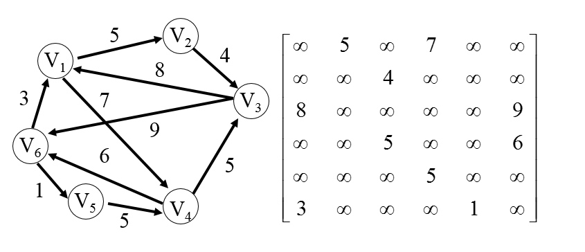
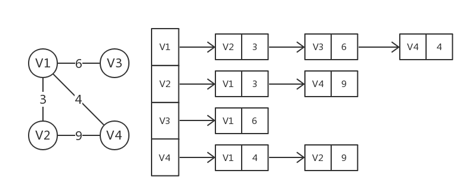
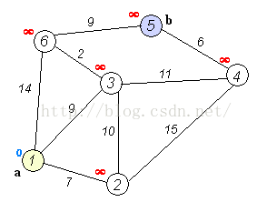

# 图（Graph）

## 简介
图是G =（V，E）的有序对，其包括顶点或节点的集合V以及边或弧的集合E，其中E包括了两个来自V的元素（即边与两个顶点相关联，并且该关联为这两个顶点的无序对）。

## 无向图和有向图
* 无向图：图的邻接矩阵是对称的，因此如果存在节点u到节点v的边，那节点v到节点u的边也一定存在。
* 有向图：图的邻接矩阵不是对称的。因此如果存在节点u到节点v的边并不意味着一定存在节点v到节点u的边。

## 图的存储结构

### 邻接矩阵
* 邻接矩阵是表示顶点之间相邻关系的矩阵，适于存储边的数目较多的稠密图。
* 假设图中顶点数为n，则邻接矩阵An×n：
    * 无权图：对于若Vi和Vj之间有边，A[i][j]=1；反之，A[i][j]=0。
    * 带权图：对于若Vi和Vj之间有边，A[i][j]=该边的权值；反之，A[i][j]=0。
* 注意：
    * 图中无邻接到自身的弧，因此邻接矩阵主对角线为全零。
    * 无向图的邻接矩阵一定是一个对称矩阵，可采用压缩存储的思想，只存储上（下）三角形阵的元素即可。
* 局限性：要确定图中有多少条边，必须按行、列检测每个元素，花费时间代价很大。
* 示例：

### 邻接表
* 基本思想：为图中的每个顶点Vi建立一个单链表，链表中结点表示依附于该顶点的边。
* 注意：
    * 在无向图的邻接表中，第i个链表中结点数目为顶点i的度；所有链表中结点数目的一半为图中边数；占用的存储单元数目为n+2e。
    * 在有向图的邻接表中，第i个链表中结点数目为顶点i的出度；所有链表中结点数目为图中弧数；占用的存储单元数目为n+e。
* 为求出每一个顶点的入度，必须另外建立有向图的逆邻接表。有向图的逆邻接表与邻接表类似，只是它是从入度考虑结点，而不是从出度考虑结点。
* 示例：

## DFS和BFS
注：如果图中有环，可能会造成死循环。解决办法是：遍历时记录哪些点已被遍历过，哪些点没被遍历到，通常使用Hash实现。

### 深度优先搜索（Depth First Search，DFS）
* 深度优先搜索是一种先遍历子节点而不回溯的遍历算法。
* 使用递归或栈Stack实现。
* 时间复杂度：O(|V| + |E|)

### 广度优先搜索（Breadth First Search，BFS）
* 广度优先搜索是一种先遍历邻居节点而不是子节点的遍历算法。
* 使用队列Queue实现。
* 时间复杂度：O(|V| + |E|)

## 单源最短路径
* 单源最短路径，在现实中是很多应用的，是图的经典应用，比如在地图中找出两个点之间的最短距离、最小运费等。单源最短路径的问题：已知图G=(V,E)，找出给定源顶点s∈V到每个顶点v∈V的最短路径。
* 衍生出的变体问题如下：
    * 单终点最短路径问题：找出从每个顶点v到指定终点t的最短路径。这个是单源最短路径的反向，把图的每条边反向，问题就变成单源最短路径的问题；
    * 单对顶点间最短路径问题：对于给定顶点u和v，找出从u到v的一条最短路径。找出所有顶点的单源最短路径，该问题自然得解。
    * 每对顶点间最短路径问题：对于任意给定顶点u和v，找出从u到v的最短路径。

### Dijkstra算法
* Dijkstra算法是一种查找单源最短路径的算法，要求每条边的权值非负。
* 算法流程：
    1. 首先需要记录每个点到原点的最短距离Di，这个距离会在每一轮遍历的过程中刷新。Di的初始状态为：若起始点到Vi存在边，则Di=该边的权值；否则Di=∞。
    2. 从Di中选取一个最短的边，遍历由该边连接的点的所有边，更新最短距离Di。
    3. 重复第二步，经过n-1轮计算就能得到从起始点到其他每个节点的最短距离。
* 时间复杂度：O(|V|^2 )
* 示例：

### Bellman-Ford算法
* Bellman-Ford是一种在带权图中查找单一源点到其他节点最短路径的算法。虽然时间复杂度大于Dijkstra算法，但它可以处理包含了负值边的图。
* 时间复杂度：
    * 最优：O(|E|)
    * 最差：O(|V|*|E|)

### Floyd-Warshall算法
* Floyd-Warshall算法是一种在无环带权图中寻找任意节点间最短路径的算法。该算法执行一次即可找到所有节点间的最短路径（路径权重和）。
* 算法流程：
    1. 引入两个矩阵，矩阵D中的元素D[i][j]表示顶点i到顶点j的距离。矩阵P中的元素P[i][j]，表示顶点i到顶点j经过了P[i][j]记录的值所表示的顶点。
    2. 假设图G中顶点个数为N，则需要对矩阵D和矩阵P进行N次更新。初始时，矩阵D中顶点D[i][j]的距离为顶点i到顶点j的权值；如果i和j不相邻，则D[i][j]=∞，矩阵P的值为顶点P[i][j]中j的值。
    3. 接下来开始，对矩阵D进行N次更新：如果D[i][j] > (D[i][k]+D[k][j])（表示i与j之间经过第k个顶点的距离），则更新D[i][j] = (D[i][k]+a[k][j])，更新P[i][j] = P[i][k]。其中k=1..N（或0..N-1），即循环N次。
* 时间复杂度：
    * 最优：O(|V|^3 )
    * 最差：O(|V|^3 )
    * 平均：O(|V|^3 )

## 最小代价生成树

### Prim算法
* Prim算法是一种在无向带权图中查找最小生成树的贪心算法，能够在一个图中找到连接所有节点的边的最小子集。
* 算法流程：从图中任意取出一个顶点，将其当作一棵树，然后从这棵树相邻的边中选取一条最短（权值最小）的边，并将这条边连接的顶点也并入这棵树中，不断重复这个过程，直到所有顶点都并入这棵树中，此时得到的树就是最小生成树。
* 时间复杂度：O(|V|^2)

### Kruskal算法
* Kruskal算法也是一个计算最小生成树的贪心算法，但在Kruskal算法中，图不一定是连通的。
* 算法流程：
    1. 将图中的所有边都去掉。
    2. 将边按权值从小到大的顺序添加到图中，并且保证添加的过程中不会形成环。
    3. 重复上一步，直到连接所有顶点，此时得到的树就是最小生成树。
* 时间复杂度：O(|E|log|V|)

## 拓扑排序
* 对一个有向无环图（Directed Acyclic Graph，DAG）G进行拓扑排序，是将G中所有顶点排成一个线性序列，使得图中任意一对顶点u和v，若存在边(u,v)∈E(G)，则u在线性序列中出现在v之前。
* 拓扑排序对应施工的流程图具有特别重要的作用，它可以决定哪些子工程必须要先执行，哪些子工程要在某些工程执行后才可以执行。为了形象地反映出整个工程中各个子工程（活动）之间的先后关系，可用一个有向图来表示，图中的顶点代表活动（子工程），图中的有向边代表活动的先后关系，即有向边的起点的活动是终点活动的前序活动，只有当起点活动完成之后，其终点活动才能进行。通常，我们把这种顶点表示活动、边表示活动间先后关系的有向图称做顶点活动网(Activity On Vertex Network)，简称AOV网。
* 一个AOV网应该是一个有向无环图，即不应该带有回路，因为若带有回路，则回路上的所有活动都无法进行（对于数据流来说就是死循环）。在AOV网中，若不存在回路，则所有活动可排列成一个线性序列，使得每个活动的所有前驱活动都排在该活动的前面，我们把此序列叫做拓扑序列（Topological Order），由AOV网构造拓扑序列的过程叫做拓扑排序（Topological sort）。AOV网的拓扑序列不是唯一的，满足上述定义的任一线性序列都称作它的拓扑序列。
* 实现步骤
    1. 在有向图中选一个没有前驱的顶点并且输出；
    2. 从图中删除该顶点和所有以它为起始点的边；
    3. 重复上述两步，直到所有顶点都被输出，或者当前图中不存在无前驱的顶点为止。后者代表我们的有向图是有环的，因此，也可以通过拓扑排序来判断一个图是否有环。

## 常见应用

