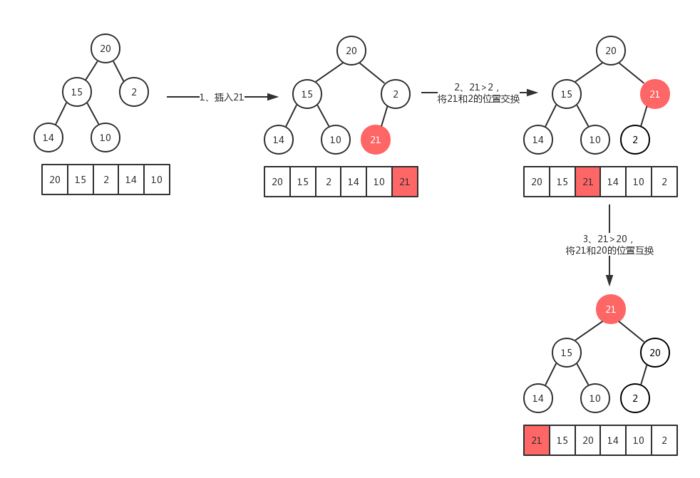
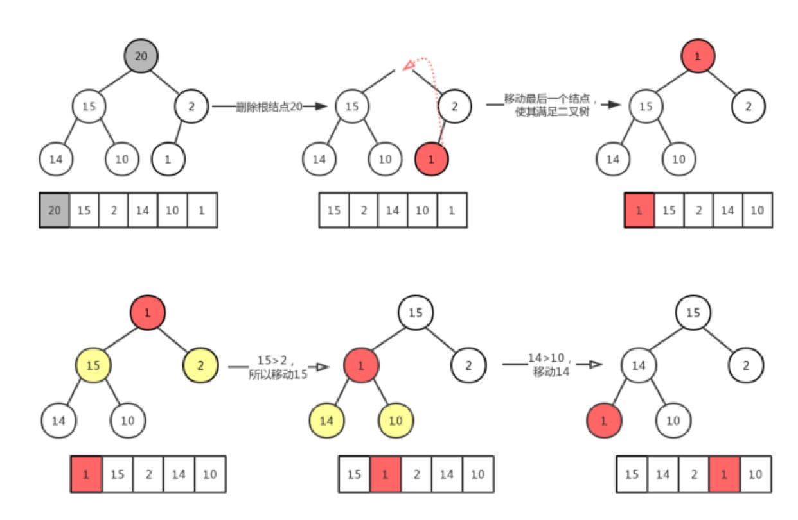

# 堆（Heap）

## 堆
* 堆是一种基于二叉树的数据结构，又被称为优先队列（Priority Queue）。Java中，PriorityQueue的底层数据结构就是堆（默认是最小堆）。
* 整个堆中的所有父子节点的键值都满足相同的排序条件，分为最大堆和最小堆。
* 时间复杂度
    * 索引：O(log(n))
    * 查找：O(log(n))
    * 插入：O(log(n))
    * 删除：O(log(n))
    * 删除最大值/最小值：O(1)

## 最大堆和最小堆
* 最大堆：父节点的键值永远大于等于所有子节点的键值，根节点的键值是最大的。
* 最小堆：父节点的键值永远小于等于所有子节点的键值，根节点的键值是最小的。

## 实现方式
* 数组（普遍）：对于每一个下标为i的节点（i从0开始）：
    * 其左子节点在下标为(2*i+1)的位置；
    * 其右子节点在下标为(2*i+2)的位置；
    * 其父节点在下标为floor((i-1)/2)的位置。
* 二叉树（直观）

## 相关操作

### 插入
插入操作是将一个元素插入到集合中，首先把该元素放集合尾部，然后执行上浮操作，如下图示例。

### 移除
移除操作时，在集合非空情况下移除集合中第一个元素，也就是下标为0的元素，然后将集合中最后一个元素移到下标为0位置，在将下标为0的新元素执行下沉操作，如下图示例。

## 常见应用

### 找最大的N个数
将开始的N个数建立size为N的小根堆，后续数据如果小于根结点，直接抛弃；如果大于根结点，则把根节点（最小的数）删除，然后插入新的数。

