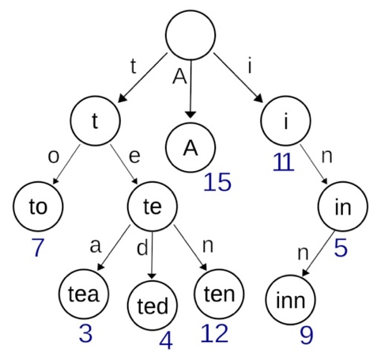
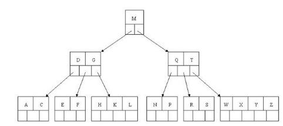

# 树（Tree）
树是无向、联通的无环图。

## 常见种类

### 二叉树（Binary Tree）
* 二叉树是一个树形数据结构，每个结点最多可以有两个子结点，称为左子结点和右子结点。
    * 满二叉树：二叉树中的每个结点有0个或2个子结点。
    * 完美二叉树：二叉树中的每个结点有两个子结点，并且所有的叶子结点的深度是一样的。
    * 完全二叉树：二叉树中除最后一层外其他各层的结点数均达到最大值，最后一层的结点都连续集中在最左边。对于完全二叉树来说，设一个结点的下标为i，则其父结点的下标为i/2，其左子结点的下标为2*i，其右子结点的下标为2*i+1。
* 性质：
    * 非空二叉树的第K层上至多有2^(K-1)个元素。
    * 深度为H的二叉树至多有2^(H-1)个结点。
* 存储结构：
    * 顺序存储（存在数组中）
    * 链式存储

### 二叉查找树（Binary Search／Sort Tree，BST）
* 二叉查找树（BST）是一种二叉树。其任何结点的值都大于等于左子树中的值，小于等于右子树中的值。
* 时间复杂度：
    * 索引：O(log(n))
    * 查找：O(log(n))
    * 插入：O(log(n))
    * 删除：O(log(n))

### 哈夫曼树（Huffman Tree）
* 哈夫曼树又称最优二叉树，是一种带权路径长度最短的二叉树。
* 所谓树的带权路径长度，就是树中所有的叶结点的权值乘其到根结点的路径长度（若根结点为0层，叶结点到根结点的路径长度则为叶结点的层数）。
* 树的带权路径长度记为WPL = (W1*L1 + W2*L2 + W3*L3 + … + Wn*Ln)，n个权值Wi(i=1,2,...,n)构成一棵有n个叶结点的二叉树，相应的叶结点的路径长度为Li(i=1,2,...,n)。
* 哈夫曼编码步骤：
    1. 对给定的n个权值{W1,W2,W3,...,Wi,...,Wn}构成n棵二叉树的初始集合F={T1,T2,T3,...,Ti,...,Tn}，其中每棵二叉树Ti中只有一个权值为Wi的根结点，它的左右子树均为空。为方便在计算机上实现算法，一般还要求以Ti的权值Wi的升序排列。
    2. 在F中选取两棵根结点权值最小的树作为新构造的二叉树的左右子树，新二叉树的根结点的权值为其左右子树的根结点的权值之和。
    3. 从F中删除这两棵树，并把这棵新的二叉树同样以升序排列加入到集合F中。
    4. 重复以上两步，直到集合F中只有一棵二叉树为止。

### 字典树（Trie）
* 字典树，是一种用于存储键值为字符串的动态集合或关联数组的查找树。
* 树中的结点并不直接存储关联键值，而是该结点在树中的位置决定了其键值。
* 根结点是空字符串。
* 示例：


### AVL树

### 红黑树

### B树（Balanced Tree）
* 树种的每个结点最多拥有m个子结点且m>=2,空树除外（注：m阶代表一个树结点最多有多少个查找路径，m阶=m路，m=2时是二叉树）。
* 除根结点外每个结点的关键字数量大于等于ceil(m/2)-1个小于等于m-1个，非根结点关键字数必须>=2。
* 所有叶子结点均在同一层、叶子结点除了包含了关键字和关键字记录的指针外也有指向其子结点的指针只不过其指针地址都为null对应下图最后一层结点的空格子。
* 如果一个非叶结点有N个子结点，则该结点的关键字数等于N-1。
* 所有结点关键字是按递增次序排列，并遵循左小右大原则。
* 两种操作：参考https://blog.csdn.net/ch18255112191/article/details/48246939
    * 插入：如果大于m-1就要分裂，中间位置的关键字上移。
    * 删除：如果小于ceil(m/2)-1就要从隔壁借或者合并。
* 示例：


### B+树

## 常见应用

### 二叉树的遍历
* 前序遍历：根->左->右
    * 递归实现非常简单。
    * 非递归实现：使用栈，先把根结点压进栈，然后开始循环，每次循环都从栈中弹出一个结点，如果结点不是null则输出，并将它的右子树和左子树依次压栈，注意此处顺序。直到栈为空时退出循环，结束遍历。（类似深度优先遍历）
* 中序遍历：左->根->右
    * 递归实现非常简单。
    * 非递归实现：使用栈，对于任一结点P：
        * 若其左子树不为空，则将P入栈并将P的左子树置为当前的P，然后再对当前结点P进行相同的处理；
        * 若其左子树为空，则访问该P结点，然后将当前的P置为P的右子树；
        * 重复以上操作直到P为null并且栈为空则遍历结束。
* 后序遍历：左->右->根
    * 递归实现非常简单。
    * 非递归实现：对于任一结点P，先将其入栈。
        * 如果P不存在左子树和右子树，则可以直接访问它；或者P存在左子树或者右子树，但是其左子树和右子树都被访问过了，则同样可以直接访问该结点。
        * 若非上述两种情况，则将P的右子树和左子树依次入栈。
        * 因此要维护一个pre指针记录上一次访问的结点，如果pre指向P的左子树或右子树，则说明P的左子树和右子树都被访问过了，可以直接访问结点P。
* 层次遍历（广度优先遍历）
    * 使用队列，先把根结点入队，然后开始循环，每次循环都从队列中出队一个元素，如果元素不是null则输出，并将它的左子树和右子树依次入队。直到队列为空时退出循环，结束遍历。

### 不使用递归和栈遍历二叉树

### 已知前序遍历、中序遍历、后序遍历中的两种，求剩下的一种。
* 前+中=>后：由前序遍历的第一个结点确定根结点，再根据中序遍历中根结点的位置，将中序遍历的结果分割为左子树和右子树，递归求解即可。
* 中+后=>前：由后序遍历的最后一个结点确定根结点，再根据中序遍历中根结点的位置，将中序遍历的结果分割为左子树和右子树，递归求解即可。
* 前+后=>中：中序遍历未知，无法求出确定解。

### 求二叉树的深度（高度）
* 递归实现：对于每一个结点P，它的高度=1+Max(它的左子树高度,它的右子树高度)，若P为null，则返回高度为0。
* 栈实现：

### 求二叉树的结点数、叶结点数、非叶结点数
* 遍历所有结点并计数即可。

### 求第K层的结点数
```java
int getKLevel(Node node, int k) {
    if (node == null || k < 1)
        return 0;
    if (k == 1)
        return 1;
    return getKLevel(node->left, k - 1) + getKLevel(node->right, k - 1);
}
```

### 判断两棵二叉树是否结构相同
```java
boolean structureCmp(Node node1, Node node2) {
    if (node1 == null && node2 == null)
        return true;
    else if (node1 == null || node2 == null)
        return false;
    boolean leftResult = structureCmp(node1.left, node2.left);
    boolean rightResult = structureCmp(node1.right, node2.right);
    return leftResult && rightResult;
}
```

### 求二叉树的镜像
```java
void mirror(Node node) {
    if (node == null)
        return;
    Node temp = node.left;
    node.left = node.right;
    node.right = temp;
    mirror(node.left);
    mirror(node.right);
}
```

### 找出任意两个结点的最低公共父结点（Lowest Common Ancestor，LCA）
```java
Node findLCA(Node node, Node target1, Node target2) {
    if (node == null)
        return null;
    if (node == target1 || node == target2)
        return node;
    Node leftResult = findLCA(node.left, target1, target2);
    Node rightResult = findLCA(node.right, target1, target2);
    if (leftResult != null && rightResult != null)
        // 分别在左右子树
        return node;
    // 都在左子树或右子树
    return leftResult != null ? leftResult : rightResult; 
}
```

### 求任意两个结点的距离
```java
int getLevel(Node node, Node target) {
    if (node == null)
        return -1;
    if (node == target)
        return 0;
    int level = getLevel(node->left, target);
    // 先在左子树找
    if (level == -1)
        // 如果左子树没找到，在右子树找
        level = getLevel(node->right, target); 
    if (level != -1)
        // 找到了，回溯
        return level + 1;
    // 如果左右子树都没找到
    return -1;  
}

int twoNodesDistance(Node node, Node target1, Node target2) {
    // 先找到最低公共祖先结点
    Node lca = findLCA(node, target1, target2);
    int level1 = getLevel(lca, target1); 
    int level2 = getLevel(lca, target2);
    return level1 + level2;
}
```

### 找出二叉树中某个结点的所有祖先结点
```java
boolean findAllAncestors(Node node, Node target) {
    if (node == null)
        return false;
    if (node == target)
        return true;
    if (findAllAncestors(node.left, target) != null || FindAllAncestors(node.right, target) != null) {
        // 找到了，输出并回溯
        System.out.println(node.data);
        return true;
    }
    //如果左右子树都没找到
    return false;
}
```

### 判断二叉树是不是完全二叉树

### 判断是否是二叉查找树的后序遍历结果

### 给定一个二叉查找树中的结点，找出在中序遍历下它的后继和前驱

### 二分查找树转化为排序的循环双链表

### 有序链表转化为平衡的二分查找树

