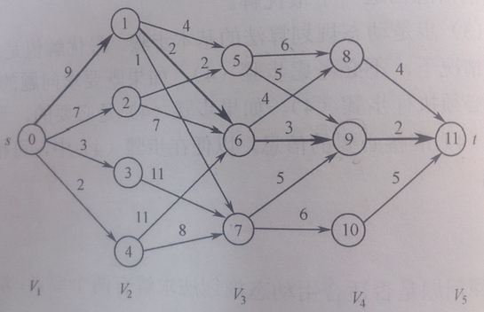

# 动态规划（Dynamic Programming）

## 概述
* 动态规划法也用于求解最优化问题，也采用分步决策的策略，将一个大问题划分成若干个较小的同类子问题，根据子问题的解，自底向上，得出整个问题的解。
* 与贪心法的异同
    * 相同：都是用于求解最优化问题；都采用分步决策，计算出每一步的最优解。
    * 不同：贪心法的每一步决策依赖于『最优量度标准』，不依赖于子问题的解和尚未作出的选择；动态规划法每一步决策依赖于子问题的解，无需最优量度标准。
* 与分治法的异同
    * 相同：都将问题话分成若干个规模较小的同类型子问题。
    * 不同：分治法会有重叠子问题的现象，对于一些子问题会重复计算，而动态规划法能避免重叠子问题现象。

## 最优子结构
* 动态规划法具有最优子结构特性。 
* 最优子结构特性：一个问题的最优解包含其子问题的最优解。 
* 当一个问题具有最优子结构特性时，在构造该问题最优解的过程中，只需考虑每一个子问题的最优解。因为每个子问题的最优解构成了该问题的最优解。

## 常见应用

### 最短路径算法
* 题目描述：给定一个带权有向图，计算任意两结点间的最短路径。
* 分析：Dijkstra算法可以计算从指定点到所有结点的最短路径长度，因此分别对每个结点使用一次迪杰斯特拉算法即可求的任意两个结点间的最短路径。迪杰斯特拉算法的时间复杂度为O(n^2 )，因此采用这种方法的时间复杂度为O(n^3 )。但是，迪杰斯特拉算法不允许权值为负数，因此需要使用弗洛伊德算法。弗洛伊德算法允许权值为负数的边，但不允许回路的路径长度为负数。因为，若回路长度为负数，那么走一次回路，路径长度一定比上一次小，故这个问题就没有意义了。
* 参考：图（Graph）。

### 0/1背包问题
* 题目描述：有一个背包，最多放Mkg的物体（物体大小不限）；有n个物体，每个物体的重量为Wi，每个物体只可以选择放进背包或不放进背包，放进背包后可获得收益Pi。问：如何放置能获得最大的收益？
* 注：背包问题分为两种，若每个物体可以切分，则称为一般背包问题，可以使用贪心法求得最优解；若每个物体不可分割，则称为0/1背包问题，这种问题用动态规划解决。这里讨论的是0/1背包问题。
* 问题分析：设f(i,m)表示第i步时背包的总收益，其中i表示当前进行到了第i步，m为当前背包载重。第i步有两种选择：
    * 将第i个物体放入背包，此时背包总收益就变成f(i-1,m-Wi)+Wi。
    * 第i个物体不放入背包，此时背包总收益就是f(i-1,m)。
* 第i步究竟怎么选择，就取决于这两种选择中哪个结果更大，因此要分别计算者两种情况的值，选较大者作为第i步的结果。
* 根据数学归纳法可知，如果从第一步开始，每一步选择的都是最优选择，那么最终可以得到最优解。

### 多段图问题
* 题目描述：给定一个多段图，求出多段图中的最短路径和最短路径长度。
* 注：多段图是一个有向、无环、带权图；它有且仅有一个起始结点和一个终止结点；它有n个阶段，每个阶段由特定的几个结点构成；每个结点的所有结点都只能指向下一个相邻的阶段，阶段之间不能越界。如图：

* 题目分析
    * 从前往后依次给所有结点编号，序号从0开始，依次递增，同一阶段的结点顺序可以随意。
    * 创建数组cost，用于记录以某个结点为起点，到终点的最短路径长度值，数组的下标表示结点的编号，数组的值表示以该结点为起点，到终点的最短路径长度。
    * 创建数组path，用于记录最短路径中出现的所有结点，数组的下标表示结点的编号，数组的值表示结点的后继结点编号。
* 算法流程：
    1. 从最后一个结点开始，从后向前，依次计算每个结点的cost值和path值；
    2. 对于结点i，找到其所有的出边，假设出边的终点分别是a、b、c，边上的权值分别是w1、w2、w3，分别计算w1+cost[a]、w2+cost[b]、w3+cost[c]，将其中最小的那个值作为cost[i]；并将最小的那个后继结点作为d[i]。
    3. 直到将所有结点都计算完毕后，即可得到最短路径。

### 最长公共子序列
* 题目描述：给定两个序列，求出它们的最长公共子序列。如：序列X={a,b,c,b,d,a,b}，Y={b,d,c,a,b,a}，则X和Y的最长公共子序列为{b,c,b,a}。
* 注意：子序列为原序列的一个子集，并不要求连续，但要求子序列中元素的顺序和原序列元素的顺序一致。

