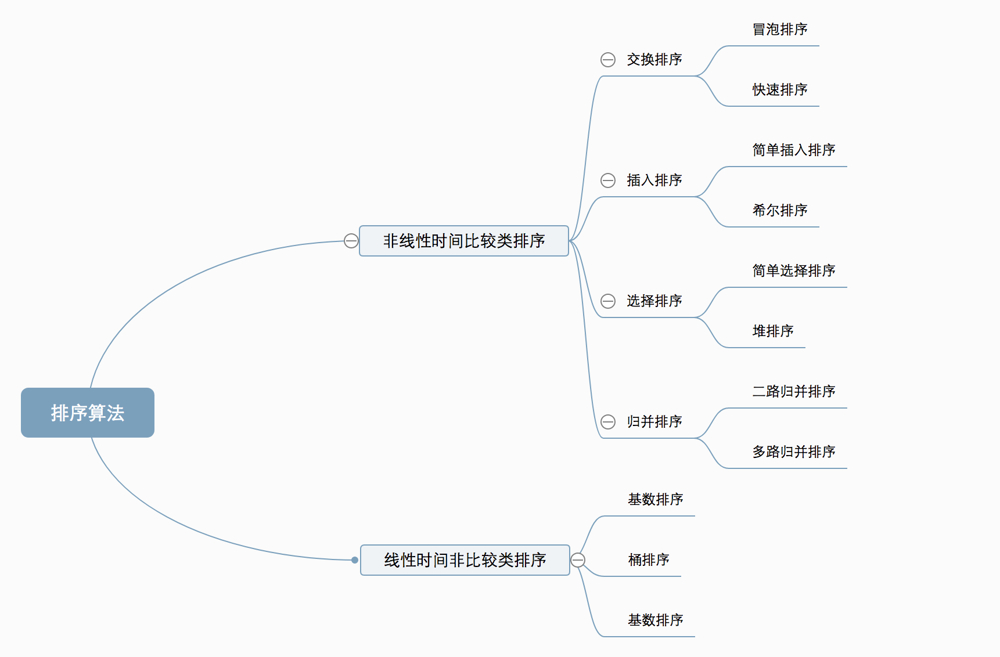
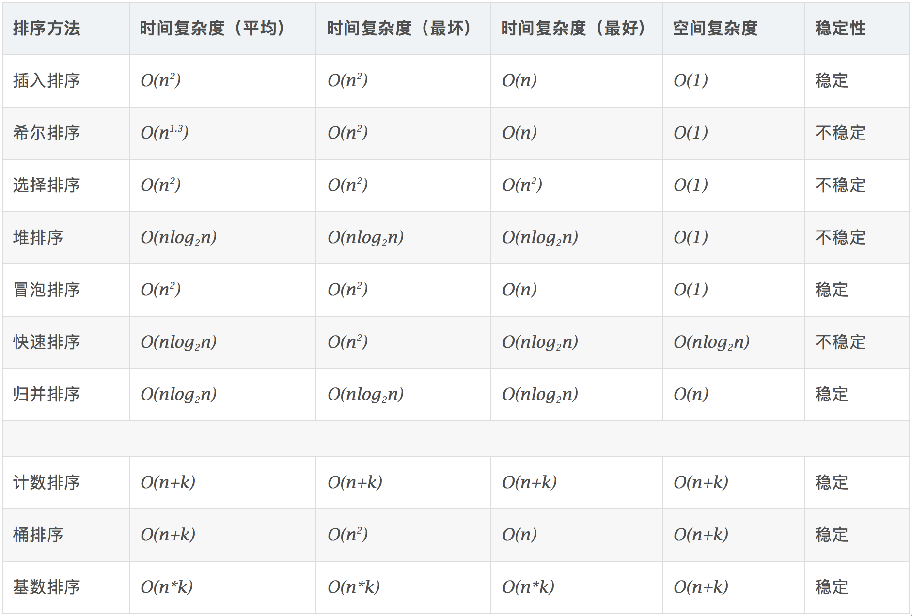
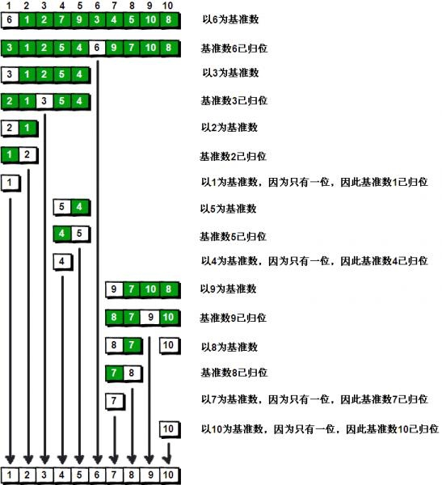

# 排序算法（Sort）

## 排序算法的稳定性
* 稳定：如果a原本在b前面，而a=b，排序之后a仍然在b的前面。
* 不稳定：如果a原本在b的前面，而a=b，排序之后a可能会出现在b的后面。

## 排序算法的分类

## 排序算法的比较

## 各种排序算法详解

### 冒泡排序（Bubble Sort）
* 冒泡排序重复地走访要排序的数列，一次比较两个元素，如果它们的顺序错误就把它们交换过来，直到没有需要交换的元素时，排序完成。
* 算法描述：
    1. 比较相邻的元素。如果第一个比第二个大，就交换它们两个；
    2. 对每一对相邻元素作同样的工作，从开始第一对到结尾的最后一对，这样在最后的元素应该会是最大的数；
    3. 针对所有的元素重复以上的步骤，除了最后一个；
    4. 重复步骤1~3，直到排序完成。
* 算法优化：设置一个标志位检测是否发生数据交换，如果没有发生数据交换，直接完成排序，这样有可能达到O(n)的时间复杂度，即数据集原本就已经排好序了。
* 例子：

### 选择排序（Select Sort）
* 首先在未排序序列中找到最小（大）元素，存放到排序序列的起始位置，然后，再从剩余未排序元素中继续寻找最小（大）元素，然后放到已排序序列的末尾。以此类推，直到所有元素均排序完毕。
* 算法描述：
    1. 初始状态：无序区为R[1..n]，有序区为空；
    2. 第i趟排序(i=1,2,…,n-1)开始时，当前有序区和无序区分别为R[1..i-1]和R(i..n）。该趟排序从当前无序区中选出关键字最小的记录R[k]，将它与无序区的第1个记录R交换，使R[1..i]和R[i+1..n)分别变为记录个数增加1个的新有序区和记录个数减少1个的新无序区；
    3. n-1趟结束，数组有序化了。
* 例子：

### 插入排序（Insert Sort）
* 通过构建有序序列，对于未排序数据，在已排序序列中从后向前扫描，找到相应位置并插入。
* 算法描述：
    1. 从第一个元素开始，该元素可以认为已经被排序；
    2. 取出下一个元素，在已经排序的元素序列中从后向前扫描；
    3. 如果该元素（已排序）大于新元素，将该元素移到下一位置；
    4. 重复步骤3，直到找到已排序的元素小于或者等于新元素的位置；
    5. 将新元素插入到该位置后；
    6. 重复步骤2~5。
* 例子：

### 希尔排序（Shell's Sort）
* 1959年Shell发明，第一个突破O(n^2 )的排序算法，是简单插入排序的改进版，它先将整个待排序的记录序列分割成为若干子序列分别进行直接插入排序。
* 算法描述：
    1. 选择一个增量序列t1，t2，…，tk，其中ti>tj，tk=1；
    2. 按增量序列个数k，对序列进行k趟排序；
    3. 每趟排序，根据对应的增量ti，将待排序列分割成若干长度为m的子序列，分别对各子表进行直接插入排序。
    4. 仅当增量因子为1时，整个序列作为一个表来处理，表长度即为整个序列的长度。
* 各种步长序列：
    * 希尔（Shell）的原始步长序列：1，2，4，…，N/4，N/2;
    * 希伯德（Hibbard）的步长序列：1，3，7，…，2^N - 1;
    * 克努特（Knuth）的步长序列：1，4，13，…，(3^N - 1)/2;
* 例子：（Shell步长序列）
* 为什么希尔排序能突破O(n^2 )？
    * 可以用逆序数来理解，假设我们要从小到大排序，一个数组中取两个元素如果前面比后面大，则为一个逆序。容易看出排序的本质就是消除逆序数，可以证明对于随机数组，逆序数是O(n^2 )的。
    * 如果采用交换相邻元素的办法来消除逆序，每次正好只消除一个，因此必须执行O(n^2 )的交换次数，这就是为啥冒泡排序只能到平方级别的原因。
    * 反过来，基于交换元素的排序要想突破这个下界，必须执行一些比较、交换相隔比较远的元素，使得一次交换能消除一个以上的逆序，希尔、快排、堆排等等算法都是交换比较远的元素，只不过规则各不同罢了。

### 归并排序（Merge Sort）
* 归并排序是一种分治算法。这个算法不断地将一个数组分为两部分，分别对左子数组和右子数组排序，然后将两个数组合并为新的有序数组。
* 算法描述：
    1. 把长度为n的输入序列分成两个长度为n/2的子序列；
    2. 对这两个子序列分别采用归并排序；
    3. 将两个排序好的子序列合并成一个最终的排序序列。
* 例子：

### 快速排序（Quick Sort）
* 基本思想：挖坑填数 + 分治法
* 算法描述：
    1. 先从数列中取出一个数作为基准数（pivot）。
    2. 将比这个数大的数全放到它的右边，小于或等于它的数全放到它的左边。
    3. 再对左右区间重复第二步，直到各区间只有一个数。
* 例子1：
* 例子2：

### 堆排序（Heap Sort）
* 堆排序是指利用堆这种数据结构所设计的一种排序算法。
* 算法描述：
    1. 将初始待排序关键字序列(R1,R2….Rn)构建成大顶堆，此堆为初始的无序区；
    2. 将堆顶元素R[1]与最后一个元素R[n]交换，此时得到新的无序区(R1,R2,…,Rn-1)和新的有序区(Rn)，且满足R[1,2,…,n-1]<=R[n]；
    3. 由于交换后新的堆顶R[1]可能违反堆的性质，因此需要对当前无序区(R1,R2,…,Rn-1)调整为新堆，然后再次将R[1]与无序区最后一个元素交换，得到新的无序区(R1,R2,…,Rn-2)和新的有序区(Rn-1,Rn)。
    4. 不断重复此过程直到有序区的元素个数为n-1，则整个排序过程完成。
* 例子：

### 计数排序（Counting Sort）
* 计数排序不是基于比较的排序算法，其核心在于将输入的数据值转化为键存储在额外开辟的数组空间中。作为一种线性时间复杂度的排序，计数排序要求输入的数据必须是有确定范围的整数。
* 算法描述：
    1. 找出待排序的数组中最大和最小的元素；
    2. 统计数组中每个值为i的元素出现的次数，存入数组C的第i项；
    3. 对所有的计数累加（从C中的第一个元素开始，每一项和前一项相加）；
    4. 反向填充目标数组：将每个元素i放在新数组的第C(i)项，每放一个元素就将C(i)减去1。
* 当输入的元素是n个0到k之间的整数时，它的运行时间是O(n+k)。由于用来计数的数组C的长度取决于待排序数组中数据的范围（等于待排序数组的最大值与最小值的差加上1），这使得计数排序对于数据范围很大的数组，需要大量时间和内存。
* 例子：

### 桶排序（Bucket Sort）
* 桶排序是计数排序的升级版，它利用了函数的映射关系，高效与否的关键就在于这个映射函数的确定。
* 桶排序的工作原理：假设输入数据服从均匀分布，将数据分到有限数量的桶里，每个桶再分别排序（有可能再使用别的排序算法或是以递归方式继续使用桶排序）。
* 算法描述
    1. 设置一个定量的数组当作空桶；
    2. 遍历输入数据，并且把数据一个一个放到对应的桶里去；
    3. 对每个不是空的桶进行排序；
    4. 从不是空的桶里把排好序的数据拼接起来。
* 桶排序的平均时间复杂度为线性的O(N+C)，其中C=N*(logN-logM)。如果相对于同样的N，桶数量M越大，其效率越高，最好的时间复杂度达到O(N)。
* 尽量减少桶内数据的数量是提高效率的唯一办法，因此我们需要尽量做到下面两点：
    * 映射函数能够将N个数据平均的分配到M个桶中，这样每个桶就有[N/M]个数据量。
    * 尽量的增大桶的数量。极限情况下每个桶只能得到一个数据，这样就完全避开了桶内数据的比较排序操作。当然，做到这一点很不容易，数据量巨大的情况下，映射函数会使得桶集合的数量巨大，空间浪费严重。这就是一个时间和空间的权衡问题了。

### 基数排序（Radix Sort）
* 基数排序的思想就是将待排数据中的每组关键字依次进行桶排序。
* 基数排序是按照低位先排序，然后收集；再按照高位排序，然后再收集；依次类推，直到最高位。有时候有些属性是有优先级顺序的，先按低优先级排序，再按高优先级排序。最后的次序就是高优先级高的在前，高优先级相同的低优先级高的在前。
* 算法描述：
    1. 取得数组中的最大数，并取得位数；
    2. arr为原始数组，从最低位开始取每个位组成radix数组；
    3. 对radix进行计数排序（利用计数排序适用于小范围数的特点）。
* 例子：

