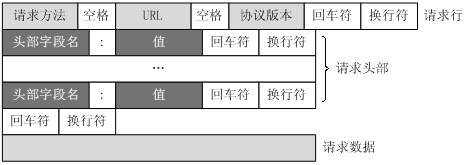

# OSI第五～七层：应用层（Application）

## 会话层的功能
* 为应用建立、管理和结束会话，并使会话同步。
* 使用检查点（Checkpoint）分割会话，分割后的会话叫做对话（Dialogue），在会话发生错误时可以恢复到上一个检查点。

## 展示层的功能
* 数据格式化。
* 数据压缩。
* 数据加密。

## 应用层的协议
* 使用TCP的协议
    * HTTP：超文本传输协议，端口号80。
    * FTP：文件传输协议，端口号20／21。
    * Telnet：远程终端协议，端口号23。
    * SMTP：简单邮件传输协议，端口号25。
    * POP3：邮局协议3，端口号110。
* 使用UDP的协议
    * TFTP：简单文件传输协议，端口号69。
    * SNMP：简单网络管理协议，端口号169。
    * DNS：域名系统，端口号53。

## HTTP协议

### 简介
* HTTP协议是Hyper Text Transfer Protocol（超文本传输协议）的缩写，是用于从服务器传输超文本到本地浏览器的传送协议。
* HTTP是无状态的，无状态是指协议对于事务处理没有记忆能力。缺少状态意味着如果后续处理需要前面的信息，则它必须重传，这样可能导致每次连接传送的数据量增大。另一方面，在服务器不需要先前信息时它的应答就较快。
* HTTP是媒体独立的，这意味着只要客户端和服务器约定好数据内容的类型，任何类型的数据都可以通过HTTP发送。客户端以及服务器指定使用适合的MIME-type内容类型。

### 报文结构

#### 请求报文

#### 响应报文

### 状态码
* 状态码分类：
    * 1XX：信息，服务器收到请求，需要请求者继续执行操作。
    * 2XX：成功，操作被成功接收并处理。
    * 3XX：重定向，需要进一步的操作以完成请求。
    * 4XX：客户端错误，请求包含语法错误或无法完成请求。
    * 5XX：服务器错误，服务器在处理请求的过程中发生了错误。
* 常用状态码：
    * 200：OK，表示请求成功，一般用于GET与POST请求。
    * 301：Moved Permanently，表示请求的资源已被永久的移动到新URI，返回信息会包括新的URI，浏览器会自动定向到新URI，并且今后任何新的请求都应使用新的URI代替。
    * 304：Not Modified，表示所请求的资源未修改，服务器返回此状态码时，不会返回任何资源，客户端通常会缓存访问过的资源，通过提供一个头信息指出客户端希望只返回在指定日期之后修改的资源。
    * 400：Bad Request，客户端请求的语法错误，服务器无法理解。
    * 401：Unauthorized，该请求要求用户的身份认证。
    * 403：Forbidden，服务器拒绝执行此请求。
    * 404：Not Found，服务器无法根据客户端的请求找到资源。
    * 405：Method Not Allowed，客户端请求中的方法被禁止。
    * 500：Internal Server Error，服务器内部错误，无法完成请求。
    * 505：HTTP Version not supported，服务器不支持请求的HTTP协议的版本，无法完成处理。

### 请求方法
* HTTP1.0定义了三种请求方法：GET，POST和HEAD方法。
* HTTP1.1新增了五种请求方法：OPTIONS，PUT，DELETE，TRACE和CONNECT方法。

### GET和POST的区别
* GET参数通过URL传递，POST参数放在请求体中，因此POST的参数传递比GET更安全。同时由于URL的长度限制，GET请求的参数长度有限制，而POST没有。
* GET请求会被浏览器主动cache，而POST不会，除非手动设置。所以GET在浏览器回退时一般是无害的，而POST回退则会再次提交请求。
* GET请求只能进行URL编码，而POST支持多种编码方式。
* GET的参数只接受ASCII字符，而POST的参数类型没有限制。
* GET和POST本质上都是TCP链接，但二者最关键的不同是：GET产生一个TCP数据包，而POST产生两个TCP数据包。过程区别如下：GET请求会把请求头和请求体一起发送，服务器响应200；而POST会先发送请求头，服务器响应100之后，再发送请求体，服务器收到后再响应200。

## DNS的解析过程
1. 先查本地DNS缓存和hosts文件是否有该域名的记录
2. 如果本地没有相应记录，就发送给本地设置的DNS服务器进行解析，这个服务器也叫Local DNS，即LDNS。
3. 如果LDNS服务器的本地缓存有对应的解析记录就会直接返回IP地址给客户端，如果没有，则LDNS服务器会从顶级域名开始，针对各个层级的DNS服务器系统进行一系列的查找继续请求其他的DNS服务器。
4. 如果这些DNS服务器都查不到，说明域名没有做好解析设置；如果查找到了，就把对应的IP地址发回LDNS，再有LDNS发回给客户端。

## HTTP与HTTPS
* HTTPS比HTTP多了一个Secure，这个Secure是由SSL提供的，SSL依靠证书来验证服务器的身份，并为浏览器和服务器之间的通信加密。
* HTTPS协议的主要作用可以分为两种：
    * 建立一个信息安全通道，来保证数据传输的安全；
    * 另一种就是确认网站的真实性。
* HTTPS和HTTP的区别主要如下：
    * HTTPS协议需要申请证书，一般免费证书较少，因而需要一定费用。
    * HTTP是超文本传输协议，信息是明文传输，HTTPS则是具有安全性的SSL加密传输协议。
    * HTTP和HTTPS使用的是完全不同的连接方式，用的端口也不一样，HTTP的端口是80，HTTPS是443。
    * HTTP的连接很简单，是无状态的；HTTPS协议是由SSL+HTTP协议构建的可进行加密传输、身份认证的网络协议，比HTTP协议安全。
* HTTPS在请求时额外的过程？
* HTTPS是如何保证数据安全的？

## 从输入网址到网页加载完成的过程
1. DNS域名解析。
2. 发起TCP的三次握手。
3. 建立TCP连接后发起HTTP请求。
4. 服务器响应HTTP请求。
5. 浏览器得到并解析HTML代码。
6. 浏览器请求HTML代码中的资源（如Javascript、CSS、图片等）。
7. 获取所有资源后，浏览器对页面进行渲染呈现给用户。

## Session和Cookie
* Cookie可以让服务端跟踪每个客户端的访问，但是每次客户端的访问都必须传回这些Cookie，如果Cookie很多，则无形的增加了客户端与服务端的数据传输量。
* 而Session则很好地解决了这个问题，同一个客户端每次和服务端交互时，将数据存储通过Session到服务端，不需要每次都传回所有的Cookie值，而是传回一个ID，每个客户端第一次访问服务器生成的唯一的ID，客户端只要传回这个ID就行了，这个ID通常为NAME为JSESSIONID的一个Cookie。这样服务端就可以通过这个ID，来将存储到服务端的Key-Value值取出了。
* 存在问题：Session和Cookie的超时问题，Cookie的安全问题。

## 负载均衡（Load Balance）

### 原理
负载均衡是将负载（工作任务、访问请求）进行平衡，分摊到多个操作单元（节点）上进行执行。

### 作用
* 解决并发压力，增加处理能力。
* 提供故障转移，实现高可用。
* 可以自由加减服务器数量，提供扩展性。
* 添加过滤和黑白名单处理，实现安全防护。

### 分类

#### DNS负载均衡
* 最早的负载均衡技术，利用域名解析实现负载均衡。
* 在DNS服务器对同一域名配置多条IP记录，这些记录对应的服务器构成集群。
* 大型网站一般会部分使用DNS解析作为第一级负载均衡。

#### IP负载均衡
* 在网络层通过修改请求目标地址进行负载均衡。
* 用户请求数据包先到达负载均衡服务器，负载均衡服务器在操作系统内核进程获取网络数据包，再根据负载均衡算法得到一台真实服务器的地址，然后将请求目标地址修改为真实服务器的地址后发送出去。
* 真实服务器处理完成后，响应数据包回到负载均衡服务器，负载均衡服务器把响应数据包源地址改为自身的地址后发回给请求用户。
* 负载均衡服务器可以同时作为真实物理服务器集群的网关。

#### 链路层负载均衡
* 在通信协议的数据链路层修改MAC地址进行负载均衡。
* 数据分发时，不修改IP地址，只修改目标MAC地址，配置真实物理服务器集群所有机器的虚拟IP和负载均衡服务器的IP地址一致。
* 不需要经过负载均衡服务器做IP地址转换，可以把响应数据包直接发回给请求用户，避免负载均衡服务器网卡带宽成为瓶颈。
* 也称直接路由模式（DR），是目前广泛使用的一种负载均衡方式。

### 软件负载均衡
* Ngnix
* Lvs
* Haproxy

## 反向代理

### 正向代理和反向代理

#### 正向代理是什么
* 在NAT技术（Network Address Translation）出现之前，所有主机无法直接与外网相连，要想上网，需要连接到一台能够访问外网的Web服务器，再通过这台服务器访问外网，这台Web服务器就叫做“正向代理服务器”。
* “翻墙”也是这样，我们把请求发给一台可以连接墙外的Web服务器，由它转发我们的请求，再将结果返回给我们。
* 综上所述：正向代理服务器是客户端和目的服务器之间的一个中介，客户端通过正向代理服务器访问客户端原本无法访问的目标服务器。

#### 反向代理是什么
* 客户端向一个服务器A提交请求后，服务器A偷偷地去服务器B上获取资源，并返回给客户端，客户端还天真地以为数据是服务器A给他的。
* 在这个过程中，服务器A称为“反向代理服务器”，服务器B称为反向代理服务器的“后端服务器”。

#### 二者区别
* “正向代理”是用户使用的技术：用户首先是知道自己要访问的目标服务器是谁，但由于某种原因无法直接访问该目标服务器，因此选择使用正向代理服务器帮忙转发请求。
* “反向代理”是服务器使用的技术：用户向服务器发送请求后，服务器在用户不知情的情况下去其他服务器上获取资源并返回给用户。 

### 反向代理服务器

#### 概述
* 反向代理服务器用于存储静态数据和缓存数据，它在请求链中的位置处于Web服务器之前。
* 当用户发起请求时，请求首先被反向代理服务器截获，若请求的是静态数据或缓存数据，则反向代理服务器直接将数据返回；若请求的是动态数据，且缓存中不存在，则反向代理服务器将请求转发给后端的Web服务器，在获取后端服务器的数据后再返回给用户。 

#### 作用
* 反向代理服务器能够分担后端服务器的压力。在请求数很高的情况下，即使服务器使用了缓存，但仍然无法应对巨大的并发数，因此需要反向代理服务器的帮忙。
* 反向代理服务器收到请求后，如果请求的是缓存数据或静态数据，则直接返回给用户，而无需再劳驾后端服务器了，从而缓解后端服务器的压力。

