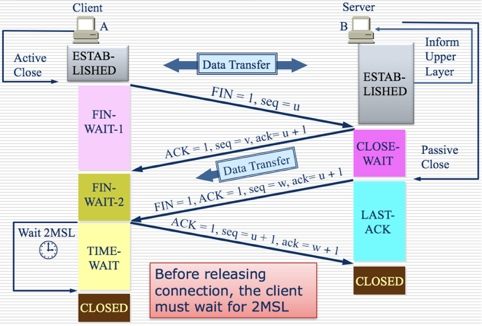

# OSI第四层：传输层（Transport）

## 传输层的功能
* 将上层应用的数据分段。
* 建立端到端的操作。
* 将数据段从一台主机发送到其他主机。
* 流控制（滑动窗口机制）和可靠性保证（序号和确认机制）。

## TCP与UDP的区别
| TCP | UDP |
| --- | --- |
| 传输控制协议，Transmission Control Protocol | 用户数据报协议，User Datagram Protocol |
| 保证可靠的面向连接协议 | 不保证可靠的无连接协议 |
| 有确认响应 | 无确认响应 |
| 提供流控制：滑动窗口机制和拥堵避免机制 | 不提供流控制 |
| 开销大 | 开销小，高效 |
| 不支持多播和广播 | 支持多播和广播 |
| 传送的数据单位是TCP报文段 | 传送的数据单位是UDP数据报 |

## TCP连接的建立与释放
* 三次握手建立连接

* 为什么是三次握手建立连接？
    * 一次握手：TCP是面向连接的，一次握手肯定建立不了连接，一条信息发出去连个回信都没有怎么连接？
    * 两次握手：当A想要建立连接时发送一个SYN，然后等待ACK，结果这个SYN因为网络问题没有及时到达B。所以A在一段时间内没收到ACK后，再发送一个SYN，这次B成功收到了，然后A也收到ACK。这时A发送的第一个SYN终于到了B，对于B来说这是一个新连接请求，然后B又为这个连接申请资源，返回ACK，然而这个SYN是个无效的请求，A收到这个SYN的ACK后也并不会理会它，但B不知道，B会一直为这个连接维持着资源，造成资源的浪费。服务器的资源是很宝贵的，不能浪费啊。
    * 四次或以上握手：三次握手已经是能够使双方知道对方设备都是好用的最少次数，四次或以上握手会浪费资源。
* 四次握手释放链接

* 为什么是四次握手释放链接？
    1. 当主机A确认发送完数据且知道B已经接受完了，想要关闭TCP通道，就会发FIN给主机B。
    2. 主机B收到A发送的FIN，表示收到了，就会发送ACK回复。
    3. 但这是B可能还在发送数据，没有想要关闭数据口的意思，所以FIN与ACK不是同时发送的，而是等到B数据发送完了，才会发送FIN给主机A。
    4. A收到B发来的FIN，知道B的数据也发送完了，就回复ACK表示收到。A等待2MSL以后，没有收到B传来的任何消息，知道B已经收到自己的ACK后关闭连接了，A就也关闭连接。
* 为什么要等待2MSL？
    * 2MSL是指2倍的MSL。
    * MSL：Maximum Segment Lifetime，是指任何报文在网络上存在的最长时间，超过这个时间的话报文将被丢弃。
    * 等待2MSL时间主要目的是怕最后一个ACK对方没收到，那么对方在超时后将重发第三次握手的FIN，那自己接到重发的FIN包后就要再发一次第四次握手的ACK，确保对方关闭。

## TCP有限状态机

## TCP如何保证数据的可靠传输

### 滑动窗口机制
* 原理
    1. 客户端和服务器分别设定自己的窗口大小，在建立TCP连接的时候双方交换信息后，双方就知道了彼此的窗口大小。
    2. 比如主机A的发送窗口大小为5，主机A可以向主机B发送5个单元，如果B缓冲区满了，A就要等待B确认才能继续发送数据。而如果B缓冲区中有1个报文被进程读取，主机B就会回复ACK给主机A，接收窗口向前滑动。
    3. 只有接收窗口向前滑动并发送了确认时，发送窗口才能向前滑动。
    4. 有利于控制流量，避免网络拥堵。
* 示例图

### 超时重传机制
* TCP协议要求在发送端每发送一个报文段，就启动一个定时器并等待确认信息。如果接收端成功接收新数据后返回确认信息则发送下一个报文段；如果在定时器超时前数据未能被确认，就认为报文段中的数据已丢失或损坏，需要重传报文段中的数据，直到发送成功为止。
* 影响超时重传机制协议效率的一个关键参数是重传超时时间（RTO，Retransmission TimeOut）。RTO的值被设置过大过小都会对协议造成不利影响。
    * RTO设长了，重发得太慢，没有效率，性能差。
    * RTO设短了，重发得太快，会增加网络拥塞，导致更多的超时，更多的超时导致更多的重发。
* TCP协议使用自适应算法（Adaptive Retransmission Algorithm）以适应互联网分组传输时延的变化。这种算法的基本要点是TCP监视每个连接的性能（即传输时延），由此推算出合适的RTO值。当连接时延性能变化时，TCP也能够相应地自动修改RTO的设定，以适应这种网络的变化。

### 停止等待协议
* 停止等待协议就是没发送完一组数据后，等待对方确认并且收到确认后，再发送下一组数据。
* 停止等待协议会出现以下4种情况
    * 无差错：正常情况，继续发送下一组数据。
    * 数据丢失：接收方没有收到数据分组，那么接收方不会发出确认，发送方过一段时间没有收到确认，就认为刚才的分组丢了，然后就会再次发送。
    * 确认丢失：发送方发送成功，接收方接收成功，确认被发送但是丢失了，那么到了等待时间，发送方没有收到确认，又会发送数据过去，此时接收方前面已经收到了数据，那么此时接收方会丢弃刚收到的数据，重新发送一次确认。
    * 确认迟到：发送方发送成功，接收方接收成功，确认被发送也没有丢失，但是由于传输太慢，等到了发送方设置的时间，发送方又会重新发送数据，此时接收方会丢弃收到的数据，重新发送确认。发送方如果收到两个或者多个确认，就停止发送，丢弃其他确认。

## 套接字（Socket）
* Socket的基本格式为：IP地址和端口号
* 每个链接的形式为：Source Socket和Destination Socket，是一条点对点、全双工的信道。
* 不支持多播和广播。

