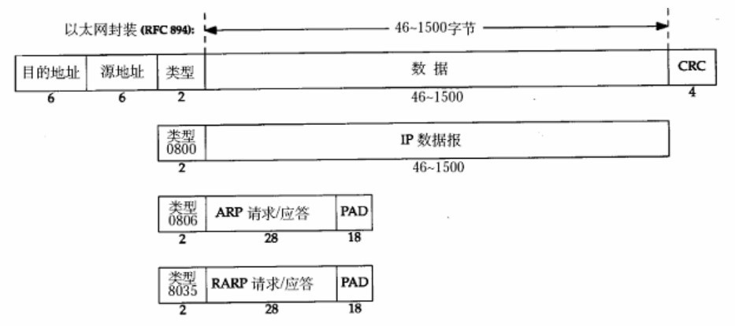
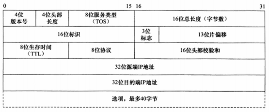
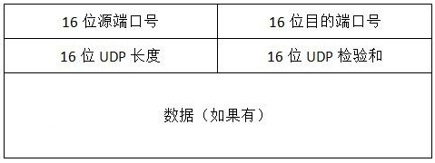
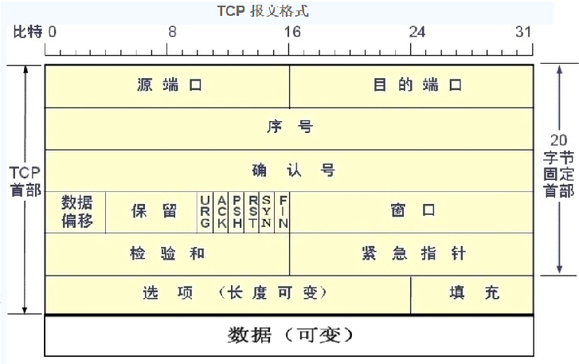
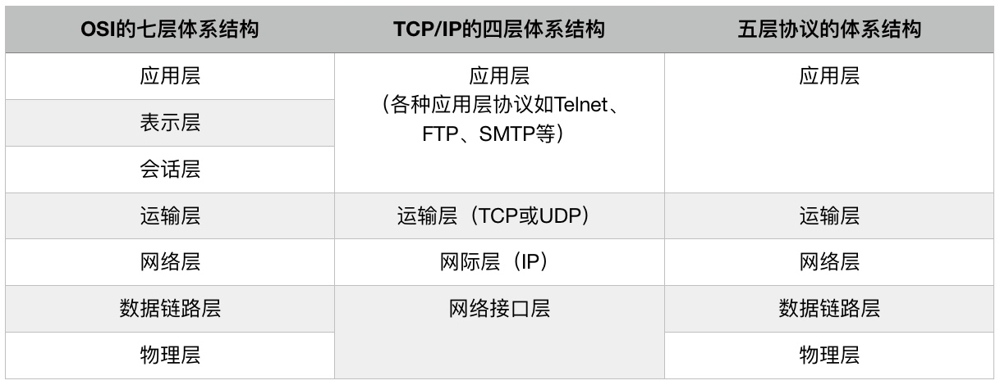

# 计算机网络参考模型

## OSI七层模型
| 层次 | 功能 |
| --- | --- |
| 物理层 | 在设备间传送比特数据，定义介质的规范。 |
| 数据链路层 | 为在局域网上主机到主机或广域网的设备间发送建立和编制帧，为物理层提供可靠的数据传输，主要关心三个基本问题：封装成帧、透明传输和差错检验。 |
| 网络层 | 为两个终端系统提供连接和路径选择。 |
| 传输层 | 在源定义数据段并编号，传送数据，并在目的地重组数据，负责终端节点之间的可靠网络通信，提供建立、维护和结束虚电路的机制、差错检验和恢复、流控制的服务。 |
| 会话层 | 在用户间建立和管理会话，同步展示层间的对话并处理数据交换，提供有效的数据传输、服务等级和会话层、展示层、应用层的异常报告。 |
| 展示层 | 提供数据的编码、压缩和加密功能。 |
| 应用层 | 最接近用户的层，为用户的应用程序提供网络服务。 |

## 数据封装（Encapsulation）

### 数据链路层：以太网帧（Frame）

* 其中的源地址和目的地址是指网卡的硬件地址（也叫MAC地址），长度是48位（6个字节），是在网卡出厂时固化的。
* 帧末尾是CRC校验码。
* 注意网卡芯片（例如DM9000A）收到的数据就是如上所示的一长串数据；其中包括以太网帧头、IP报报头、传输层协议段头、应用层所需数据。
* 以太网帧中的数据长度规定最小46字节，最大1500字节。ARP和RARP数据包的长度不够46字节，要在后面补填充位（PAD）。
* 最大值1500称为以太网的最大传输单元（MTU），不同的网络类型有不同的MTU，如果一个数据包从以太网路由到拨号链路上，数据包度大于拨号链路的MTU了，则需要对数据包进行分片（Fragmentation）。注意，MTU指数据帧中有效载荷的最大长度，不包括帧首部的长度。

### 网络层：IP数据报（Datagram）

* 首先注意，这里说的是IPv4。
* 4位版本号指定IP协议的版本。对IPv4来说，其值是4。
* 4位头部长度是指该IP数据报头部有多少个32bit（4字节），最⼩值为5。也就是说⾸部长度最⼩是4x5=20字节，也就是不带任何选项的IP⾸部；4位能表⽰的最⼤值是15，也就是说⾸部长度最⼤是60字节。
* 8位TOS字段有3个位⽤来指定IP数据报的优先级（⽬前已经废弃不⽤），还有4个位表⽰可选的服务类型（最⼩延迟、最⼤呑吐量、最⼤可靠性、最⼩成本），剩下的1个位总是0。
* 16位总长度是整个数据报（包括⾸部和数据）的字节数，以字节为单位，因此IP数据报的最大长度为65535(2^16-1 ) 字节。但由于MTU的限制，长度超过MTU的数据报都将被分片传输，所以实际传输的IP数据报（或分片）的长度都远远没有达到最大值。
* 16位标识唯一地标识主机发送的每一个数据报。初始值随机生成，每发送一个数据报，其值就加1。该值在数据报分片时被复制到每个分片中，因此同一个数据报的所有分片都具有相同的标识值。
* 3位分片标志字段的第1位保留；第2位表示“禁止分片”，即如果设置了这个位，IP将不对数据报进行分片。在这种情况下，如果IP数据报长度超过MTU的话，将丢弃该数据报并返回一个ICMP差错报文；第3位表示“还有更多分片”，即除了数据报的最后一个分片外，其他分片都要把它置1。
* 13位分片偏移是分片相对原始IP数据报开始处理（仅指数据部分）的偏移。实际的偏移值是该值左移3位（乘8）后得到的。由于这个原因，除了最后一个IP分片外，每个IP分片的数据部分的长度必须是8的整数倍（这样才能保证后面的IP分片拥有一个合适的偏移)。
* 8位生存时间（Time To Live，TTL）是数据报到达目的地之前允许经过的路由器跳数。TTL值被发送端设置（常见的值为64）。数据报在转发过程中每经过一个路由，该值就被路由器减 1。当TTL值减为0时，路由器将丢弃数据报，并向源端发送一个ICMP差错报文。TTL值可以防止IP数据报陷入路由循环。
* 8位协议用来区分上层协议，/etc/prmocols文件定义了所有上层协议对应的数值。其中ICMP是1，TCP是6，UDP是17。/etc/protocols文件是RFC 1700的一个子集。
* 16位头部校验和由发送端填充，接收端对其使用CRC算法以检验IP数据报头部（注意，仅检验头部）在传输过程中是否损坏。
* 32位的源IP地址和目的IP地址用来标识数据报的发送端和接收端。
* 选项字段是可变长的可选信息。这部分最多包含40字节，因为IP头部最长60字节（其中还包含前面讨论的20字节的同定部分）。可用的IP选项包括：记录路由、时间戳、松散路由源路由选择、严格源路由选择。
* 选项后面接的就是数据段。

### 传输层：UDP段（Segment）

### 传输层：TCP段（Segment）

* 源端口（16位）和目的端口（16位）：标识发送和接收报文的计算机端口或进程。一个TCP报文段必须包括源端口号，使目的主机知道应该向何处发送确认报文。
* 序号（32位）：用于标识每个报文段，使目的主机可确认已收到指定报文段中的数据。当源主机用于多个报文段发送一个报文时，即使这些报文到达目的主机的顺序不一样。在SYN标志未置位时，该字段指示了用户数据区中第一个字节的序号；在SYN标志已置位时，该字段指示的是初始发送的序列号。在建立连接时发送的第一个报文段中，双方都提供一个初始序列号。TCP标准推荐使用以4ms间隔递增1的计数器值作为这个初始序列号的值。使用计数器可以防止连接关闭再重新连接时出现相同的序列号。对于那些包含数据的报文段，报文段中第一个数据字节的数量就是初始序列号，其后数据字节按顺序编号。如果源主机使用同样的连接发送另一个报文段，那么这个报文段的序列号等于前一个报文段的序列号与前一个报文段中数据字节的数量之和。如果序列号增大至最大值将复位为0。
* 确认号（32位）：目的主机返回确认号，使源主机知道某个或几个报文段已被接收。例如，序列号等于前一个报文段的序列号与前一个报文段中数据字节的数量之和，比如说假设源主机发送3个报文段，每个报文段有100字节的数据，且第一个报文段的序列号是1000，那么接收到第一个报文段后，目的主机返回含确认号1100的报头。接收到第二个报文段（其序号为1100）后，目的主机返回确认号1200。接收到第三个报文段后，目的主机返回确认号1300。但是目的主机不一定在每次接收到报文段后都返回确认号，比如说在上面的例子中，目的主机可能等到所有3个报文段都收到后，再返回一个含确认号1300的报文段，表示已接收到全部数据。但是如果目的主机再发回确认号之前等待时间过长，源主机会认为数据没有到达目的主机，并自动重发。上面的例子中，如果目的主机接收到了报文段号为1000的第一个报文段以及报文段号为1200的最后一个报文段，则可返回确认号1100，但是在返回确认号1300之前，应该等待报文段号为 1100 的中间报文段。
* 数据偏移（4位）：指TCP段首部的长度。
* 保留位（6位）：由跟在数据偏移字段后的6位构成，全部为0。
* 控制位（6位）
    * SYN：表示建立连接；
    * FIN：表示关闭连接；
    * ACK：表示响应；
    * PSH：表示有DATA数据传输；
    * RST：表示连接重置；
    * UGR：表示紧急。
* 窗口（16位）：本机期望一次接收的字节数，即本机接收窗口大小。告诉对方在不等待确认的情况下，可以发来多大的数据。这里表示的最大长度是2^16-1 = 65535，如需要使用更大的窗口大小，需要使用选项中的窗口扩大因子选项。、
* 校验和（16位）：源主机和目的主机根据TCP报文段以及伪报头的内容计算校验和。在伪报头中存放着来自IP报头以及TCP报文段长度信息。与UDP一样，伪报头并不在网络中传输，并且在校验和中包含伪报头的目的是为了防止目的主机错误地接收存在路由的错误数据报。
* 紧急指针（16位）：仅在URG=1时才有意义，它指出本报文段中的紧急数据的字节数（紧急数据在普通数据前面）。注意：即使窗口为零时也可发送紧急数据。例如，如果报文段的序号是1000，前8个字节都是紧急数据，那么紧急指针就是8。紧急指针一般用来使用户可以中止进程。
* 选项、填充字段：可能包括窗口扩大因子、时间戳等选项。长度可变，最长可达40字节，当没有使用选项时，TCP首部长度是20字节。填充用于保证选项字段的长度为32bit的整数倍。
* 数据（长度可变）：TCP段中的数据。

## 五层模型和TCP/IP四层模型

